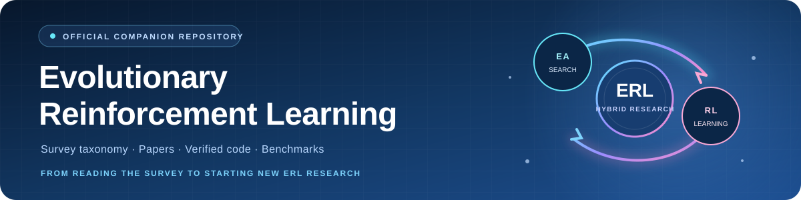
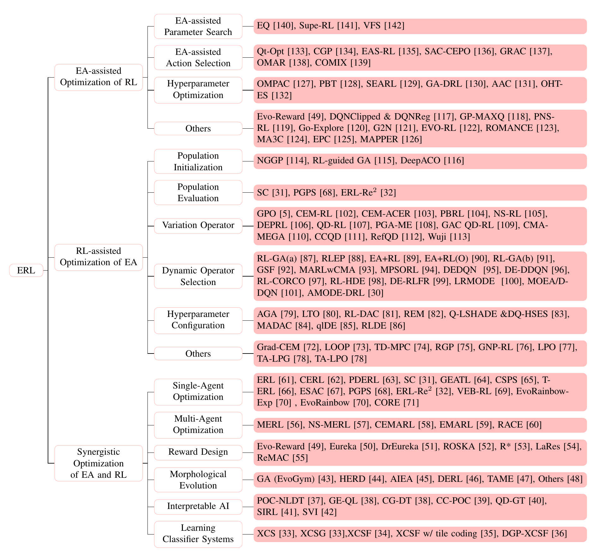
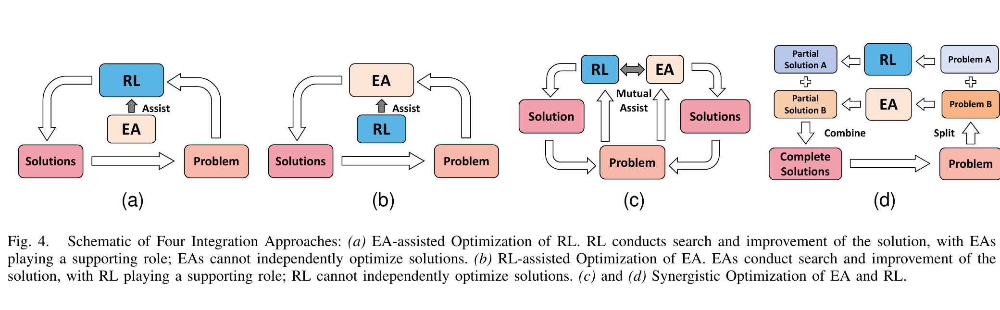

> [!IMPORTANT]
> **Official companion repository for [*Bridging Evolutionary Algorithms and Reinforcement Learning: A Comprehensive Survey on Hybrid Algorithms*](https://arxiv.org/abs/2401.11963).**<br>
> This repository helps readers enter the ERL field faster, reproduce representative methods, navigate the survey taxonomy, and track new papers and code. It currently indexes **270 canonical algorithm works** and curates **86 independently reviewed Chinese and English guide mappings across 80 unique URLs, covering 54 works**.

<div align="center" markdown="1">



# Awesome Evolutionary Reinforcement Learning

<p><strong>The research companion for studying, reproducing, and extending ERL</strong></p>

<p>
  <a href="https://awesome.re"></a>
  <a href="https://arxiv.org/abs/2401.11963"></a>
  <a href="https://doi.org/10.1109/TEVC.2024.3443913"></a>
  <a href="#bilingual-reading-guides"></a>
  <a href="#contributing"></a>
</p>

**Evolutionary Reinforcement Learning (ERL)** combines the global search and population diversity of evolutionary algorithms with the learning efficiency and decision-making capabilities of reinforcement learning. Alongside papers and verified code, this collection provides independently reviewed **中文 / English explanations** so readers can move quickly from the survey taxonomy to understanding, reproducing, and extending representative methods.

[**Read the survey**](https://arxiv.org/abs/2401.11963) · [**Browse the taxonomy**](#taxonomy) · [**中文 / English reading guides**](#bilingual-reading-guides) · [**Start from code**](#code-first-reading-list) · [**See recent work**](#recent-and-emerging-directions)

</div>

---

## Overview

| **3** major directions | **21** maintained branches | **270** canonical algorithm works | **80** with verified public code |
|:---:|:---:|:---:|:---:|
| EA → RL · RL → EA · Synergy | Survey branches plus maintained extensions | 264 taxonomy works + 6 recent works | Canonical works with an exact code match |

<sub>Reproducible count policy (30 Aug 2026): one canonical work equals one unique paper record, regardless of aliases, variants, or cross-listings. The 270 total excludes tooling/benchmarks, field overviews, and the independent watchlist. Code coverage counts canonical works with an exact author/official or explicitly labeled community implementation.</sub>

> [!IMPORTANT]
> **Which survey version should you use?** Cite the [IEEE version of record](https://ieeexplore.ieee.org/document/10637292), read [arXiv v5](https://arxiv.org/abs/2401.11963) for the latest paper content, and use this repository for code and ongoing updates. [See the exact differences ↓](#survey-versions)

### Choose a direction

| 01 · **EA assists RL** | 02 · **RL assists EA** | 03 · **EA and RL collaborate** |
|---|---|---|
| Evolution searches policies, actions, hyperparameters, curricula, or reward structures for RL. | RL configures initialization, evaluation, variation, operator selection, and EA hyperparameters. | Population search and gradient learning exchange information or optimize jointly. |
| [Explore EA-assisted RL ↓](#ea-assisted-optimization-of-rl) | [Explore RL-assisted EA ↓](#rl-assisted-optimization-of-ea) | [Explore synergistic ERL ↓](#synergistic-optimization-of-ea-and-rl) |

### Quick paths

**Need reproducible baselines?** Start from the [code-first list](#code-first-reading-list) and [frameworks](#frameworks-benchmarks-and-tooling).<br>
**Need an explanation first?** Start from the integrated [bilingual reading-guide overview](#bilingual-reading-guides), then open the full work-by-work guide when you need a specific method.<br>
**Tracking the newest work?** Go to [recent and emerging directions](#recent-and-emerging-directions).

> [!NOTE]
> **Code labels:** repository links are author-maintained unless explicitly marked as a community implementation. `Not found` means no verified public implementation was located. Some methods are intentionally cross-listed when one mechanism contributes to multiple branches.

<details markdown="1">
<summary><strong>Changelog</strong></summary>

- **30 Aug 2026** — completed a multi-scope coverage adjudication: added 120 canonical works, expanded the collection to 270 papers and 80 verified code artifacts, corrected QD-PG metadata, and retained 14 independently tracked boundary items in a non-counting watchlist.
- **29 Aug 2026** — refined the bilingual [reading guide](READING_GUIDES.md) to 86 verified work-link mappings across 54 works after a stricter mechanism-depth audit removed mismatched and installation-only references.
- **28 Aug 2026** — synchronized the collection with arXiv v5; added Reward Design, Dynamic Operator Selection, missing QD methods, recent 2024–2026 work, verified code repositories, frameworks, and updated taxonomy figures.
- **26 Jul 2024** — the survey was accepted by *IEEE Transactions on Evolutionary Computation*.

</details>

<details markdown="1">
<summary><strong>Full section index</strong></summary>

- [Overview](#overview)
- [Bilingual reading guides](#bilingual-reading-guides)
- [Taxonomy](#taxonomy)
- [Survey versions](#survey-versions)
- [Code-first reading list](#code-first-reading-list)
- [EA-assisted Optimization of RL](#ea-assisted-optimization-of-rl)
  - [EA-assisted Parameter Search](#ea-assisted-parameter-search)
  - [EA-assisted Action Selection](#ea-assisted-action-selection)
  - [Hyperparameter Optimization](#hyperparameter-optimization)
  - [Algorithm and Update-rule Discovery](#algorithm-and-update-rule-discovery)
  - [Other EA-assisted RL methods](#other-ea-assisted-rl-methods)
- [RL-assisted Optimization of EA](#rl-assisted-optimization-of-ea)
  - [Population Initialization](#population-initialization)
  - [Population Evaluation](#population-evaluation)
  - [Variation Operator](#variation-operator)
  - [Quality-Diversity](#quality-diversity)
  - [Dynamic Operator Selection](#dynamic-operator-selection)
  - [Dynamic Algorithm Configuration](#dynamic-algorithm-configuration)
  - [Dynamic Resource Allocation](#dynamic-resource-allocation)
  - [Other RL-assisted EA methods](#other-rl-assisted-ea-methods)
- [Synergistic Optimization of EA and RL](#synergistic-optimization-of-ea-and-rl)
  - [Single-Agent Optimization](#single-agent-optimization)
  - [Adaptive, Staged, or Stabilized Coupling](#adaptive-staged-or-stabilized-coupling)
  - [Representation and Search Decomposition](#representation-and-search-decomposition)
  - [Multi-Agent Optimization](#multi-agent-optimization)
  - [Reward Design](#reward-design)
  - [Morphological Evolution](#morphological-evolution)
  - [Interpretable AI](#interpretable-ai)
  - [Learning Classifier Systems](#learning-classifier-systems)
- [Frameworks, benchmarks, and tooling](#frameworks-benchmarks-and-tooling)
- [Recent and emerging directions](#recent-and-emerging-directions)
- [Related surveys](#related-surveys)
- [Contributing](#contributing)
- [Citation](#citation)

</details>

## Bilingual reading guides

The reading guide is integrated into this repository as a second layer over the survey taxonomy: use the compact paths below to enter a direction quickly, then open the [complete work-by-work guide](READING_GUIDES.md) for all reviewed resources.

| **270** works reviewed | **54** works covered | **27** with Chinese material | **45** with English material | **86** verified mappings |
|:---:|:---:|:---:|:---:|:---:|
| Full collection | At least one guide | 中文讲解 | English guides | 80 unique URLs |

> **Core** marks substantial, work-specific explanations. **Extended** marks concise but mechanism-bearing overview sections, project documentation, thesis chapters, posters, or talk slides. Installation-only repositories, abstract restatements, and references that merely mention a method are excluded.

Guide coverage and mapping counts are deduplicated by canonical paper/work URL, language, guide URL, and Core/Extended label; aliases and cross-lists do not add mappings.

| Research direction | Coverage | Suggested starting points |
|---|:---:|---|
| **EA assists RL** | **13 / 47** works | [PBT · English](https://deepmind.google/blog/population-based-training-of-neural-networks/) · [Go-Explore · 中文](https://zhkmxx9302013.github.io/2019-04-20_%E8%AE%BA%E6%96%87GoExplore.html) · [Qt-Opt · English](https://research.google/blog/scalable-deep-reinforcement-learning-for-robotic-manipulation/) |
| **RL assists EA** | **15 / 105** works | [DeepACO · 中文](https://birdie-go.github.io/2024/01/20/DeepACO-Neural-enhanced-Ant-Systems-for-Combinatorial-Optimization/) · [LOOP · English](https://blog.ml.cmu.edu/2022/01/07/loop/) · [TD-MPC · 中文](https://worldsensetech.com/zh/articles/td-mpc-world-model-control/) |
| **EA and RL collaborate** | **23 / 112** works | [RACE · 中文](https://zhuanlan.zhihu.com/p/647913479) · [Eureka · English](https://blogs.nvidia.com/blog/eureka-robotics-research/) · [ROSKA · 中文](https://m.thepaper.cn/newsDetail_forward_30397998) |
| **Recent directions** | **3 / 6** works | Follow verified projects and author material in the full guide. |

**[Browse the complete bilingual guide →](READING_GUIDES.md)**

## Taxonomy

Survey v5 organizes ERL into three major directions and sixteen research branches. The maintained repository uses twenty-one branches after adding five evidence-backed extensions: algorithm/update-rule discovery, quality-diversity, dynamic resource allocation, adaptive/staged/stabilized coupling, and representation/search decomposition.

<p align="center">
  
</p>

<p align="center"><sub><strong>Figure 1.</strong> Taxonomy of evolutionary reinforcement learning in survey v5.</sub></p>

> [!NOTE]
> Survey v5 Table V and the body text additionally include **LERO** under Reward Design and discuss **XCSRG** alongside XCSG. The detailed tables below follow the more complete body and tabular taxonomy.

<p align="center">
  
</p>

<p align="center"><sub><strong>Figure 2.</strong> Four integration patterns connecting EA and RL across solution and decomposed problem spaces.</sub></p>

## Survey versions

| Version | Status and recommended use |
|---|---|
| **Official published version** | [IEEE TEVC](https://ieeexplore.ieee.org/document/10637292), Vol. 29, No. 5, pp. 1707–1728, 2025 · [DOI](https://doi.org/10.1109/TEVC.2024.3443913)<br>The peer-reviewed version of record. **Use it for formal citation.** |
| **Current paper version** | [arXiv v5](https://arxiv.org/abs/2401.11963), revised **24 May 2026** · [PDF](https://arxiv.org/pdf/2401.11963)<br>The author-updated manuscript with expanded method coverage. **Use it for the latest survey content.** |
| **Current repository version** | Synced **30 Aug 2026** with v5, multi-scope coverage adjudication, verified code links, frameworks, and a separately counted watchlist. **Use it for implementation and tracking.** |

> **Difference at a glance:** **IEEE = archival citation** · **arXiv v5 = latest paper content** · **GitHub = maintained implementation index**

The repository includes code availability, tooling, and newer work that should not be treated as part of the archival IEEE article.

**Paper:** *Bridging Evolutionary Algorithms and Reinforcement Learning: A Comprehensive Survey on Hybrid Algorithms* — Pengyi Li, Jianye Hao, Hongyao Tang, Xian Fu, Yan Zheng, and Ke Tang.

## Code-first reading list

The following papers have public implementations verified against the paper, project page, or authors' repositories and are useful starting points. Community reimplementations are kept out of this short list and labeled explicitly in the full taxonomy.

<details open markdown="1">
<summary><strong>Verified code-first collection (31 entries)</strong></summary>

| Direction | Method | Paper | Code | Guide |
| --- | --- | --- | --- | --- |
| EA-assisted RL | SAC-CEPO | [Soft Actor-Critic with Cross-Entropy Policy Optimization](https://arxiv.org/abs/2112.11115) | [wcgcyx/SAC-CEPO](https://github.com/wcgcyx/SAC-CEPO) | Not found |
| EA-assisted RL | GRAC | [GRAC: Self-Guided and Self-Regularized Actor-Critic](https://arxiv.org/abs/2009.08973) | [stanford-iprl-lab/GRAC](https://github.com/stanford-iprl-lab/GRAC) | [EN · Extended](https://github.com/stanford-iprl-lab/GRAC "Self-Guided and Self-Regularized Actor-Critic (GRAC)") |
| EA-assisted RL | OMAR | [Plan Better Amid Conservatism: Offline Multi-Agent Reinforcement Learning with Actor Rectification](https://arxiv.org/abs/2111.11188) | [ling-pan/OMAR](https://github.com/ling-pan/OMAR) | Not found |
| EA-assisted RL | SEARL | [Sample-Efficient Automated Deep Reinforcement Learning](https://arxiv.org/abs/2009.01555) | [automl/SEARL](https://github.com/automl/SEARL) | [EN · Extended](https://github.com/automl/SEARL "Sample-Efficient Automated Deep Reinforcement Learning") |
| EA-assisted RL | Evolving RL Algorithms | [Evolving Reinforcement Learning Algorithms](https://arxiv.org/abs/2101.03958) | [google/brain_autorl](https://github.com/google/brain_autorl/tree/main/evolving_rl) | [EN 1 · Core](https://research.google/blog/evolving-reinforcement-learning-algorithms/ "Evolving Reinforcement Learning Algorithms")<br>[EN 2 · Core](https://medium.com/aureliantactics/implementing-dqnclipped-and-dqnreg-with-stable-baselines-4e3f02160466 "Implementing DQNClipped and DQNReg with Stable Baselines") |
| EA-assisted RL | Go-Explore | [Go-Explore: a New Approach for Hard-Exploration Problems](https://arxiv.org/abs/1901.10995) | [uber-research/go-explore](https://github.com/uber-research/go-explore) | [中文 1 · Core](https://zhkmxx9302013.github.io/2019-04-20_%E8%AE%BA%E6%96%87GoExplore.html "[论文] Go-Explore")<br>[中文 2 · Core](https://ldy-php.mysxl.cn/blog/first-return-then-explore "First return, then explore.")<br>[EN 1 · Core](https://www.uber.com/mo/en/blog/go-explore/ "Montezuma’s Revenge Solved by Go-Explore, a New Algorithm for Hard-Exploration Problems (Sets Records on Pitfall, Too)")<br>[EN 2 · Extended](https://lilianweng.github.io/posts/2020-06-07-exploration-drl/ "Exploration Strategies in Deep Reinforcement Learning") |
| EA-assisted RL | ROMANCE | [Robust Multi-Agent Coordination via Evolutionary Generation of Auxiliary Adversarial Attackers](https://arxiv.org/abs/2305.05909) | [zzq-bot/ROMANCE](https://github.com/zzq-bot/ROMANCE) | Not found |
| EA-assisted RL | EvIL | [Evolution Strategies for Generalisable Imitation Learning](https://arxiv.org/abs/2406.11905) | [SilviaSapora/evil](https://github.com/SilviaSapora/evil) | [EN · Extended](https://github.com/SilviaSapora/evil "EvIL: Evolution Strategies for Generalisable Imitation Learning") |
| RL-assisted EA | DeepACO | [DeepACO: Neural-Enhanced Ant Systems for Combinatorial Optimization](https://arxiv.org/abs/2309.14032) | [henry-yeh/DeepACO](https://github.com/henry-yeh/DeepACO) | [中文 1 · Core](https://birdie-go.github.io/2024/01/20/DeepACO-Neural-enhanced-Ant-Systems-for-Combinatorial-Optimization/ "DeepACO Neural-enhanced Ant Systems for Combinatorial Optimization")<br>[中文 2 · Core](https://peterliuzhi.top/posts/%E8%AE%BA%E6%96%87%E7%AC%94%E8%AE%B0/%E8%AE%BA%E6%96%87%E7%AC%94%E8%AE%B0deepaco-neural-enhanced-ant-systems-for-combinatorial-optimization/ "〖论文笔记〗DeepACO Neural-enhanced Ant Systems for Combinatorial Optimization")<br>[EN · Extended](https://github.com/henry-yeh/DeepACO "DeepACO: Neural-enhanced Ant Systems for Combinatorial Optimization") |
| RL-assisted EA | CEM-RL | [Combining Evolutionary and Gradient-Based Methods for Policy Search](https://arxiv.org/abs/1810.01222) | [apourchot/CEM-RL](https://github.com/apourchot/CEM-RL) | [中文 · Extended](https://zhuanlan.zhihu.com/p/704285528 "EvoRainbow：演化强化学习策略搜索的集大成者")<br>[EN · Extended](https://lilianweng.github.io/posts/2019-09-05-evolution-strategies/ "Evolution Strategies — CEM-RL") |
| RL-assisted EA | PGA-ME | [Policy Gradient Assisted MAP-Elites](https://doi.org/10.1145/3449639.3459304) | [ollebompa/PGA-MAP-Elites](https://github.com/ollebompa/PGA-MAP-Elites) | [EN · Extended](https://qdax.readthedocs.io/en/latest/examples/pgame/ "Optimizing with PGAME in JAX") |
| RL-assisted EA | CMA-MEGA | [Approximating Gradients for Differentiable Quality Diversity in Reinforcement Learning](https://arxiv.org/abs/2202.03666) | [icaros-usc/dqd-rl](https://github.com/icaros-usc/dqd-rl) | [EN 1 · Extended](https://dqd-rl.github.io/ "Approximating Gradients for Differentiable Quality Diversity in Reinforcement Learning")<br>[EN 2 · Extended](https://slides.btjanaka.net/dqd-rl-gecco/ "Differentiable Quality Diversity in Reinforcement Learning (GECCO slides)") |
| RL-assisted EA | CCQD | [Sample-Efficient Quality-Diversity by Cooperative Coevolution](https://openreview.net/forum?id=JDud6zbpFv) | [lamda-bbo/CCQD](https://github.com/lamda-bbo/CCQD) | Not found |
| RL-assisted EA | RefQD | [Quality-Diversity with Limited Resources](https://arxiv.org/abs/2406.03731) | [lamda-bbo/RefQD](https://github.com/lamda-bbo/RefQD) | [EN · Extended](https://github.com/lamda-bbo/RefQD "RefQD: Reference-based Quality Diversity") |
| RL-assisted EA | Wuji | [Automatic Online Combat Game Testing Using Evolutionary Deep Reinforcement Learning](https://doi.org/10.1109/ASE.2019.00077) | [NeteaseFuxiRL/wuji](https://github.com/NeteaseFuxiRL/wuji) | [中文 · Core](https://cloud.tencent.com/developer/article/1527015 "获顶会最佳论文，天津大学等用强化学习寻找游戏bug") |
| Synergistic | ERL | [Evolution-Guided Policy Gradient in Reinforcement Learning](https://arxiv.org/abs/1805.07917) | [ShawK91/Evolutionary-Reinforcement-Learning](https://github.com/ShawK91/Evolutionary-Reinforcement-Learning) | [EN 1 · Extended](https://master-dac.isir.upmc.fr/rl/evo%2Brl_policies.pdf "Evolution + Deep RL — Using Evolution to Optimize Policies")<br>[EN 2 · Extended](https://github.com/ShawK91/Evolutionary-Reinforcement-Learning "Evolution-Guided Policy Gradient in Reinforcement Learning") |
| Synergistic | CERL | [Collaborative Evolutionary Reinforcement Learning](https://arxiv.org/abs/1905.00976) | [intel/cerl](https://github.com/intel/cerl) | [EN · Core](https://spectrum.ieee.org/reinforcement-learning "Greedy AI Agents Learn to Cooperate") |
| Synergistic | PDERL | [Proximal Distilled Evolutionary Reinforcement Learning](https://arxiv.org/abs/1906.09807) | [crisbodnar/pderl](https://github.com/crisbodnar/pderl) | [中文 · Extended](https://zhuanlan.zhihu.com/p/704285528 "EvoRainbow：演化强化学习策略搜索的集大成者") |
| Synergistic | ERL-Re2 | [ERL-Re^2: Efficient Evolutionary Reinforcement Learning with Shared State Representation and Individual Policy Representation](https://arxiv.org/abs/2210.17375) | [yeshenpy/ERL-Re2](https://github.com/yeshenpy/ERL-Re2) | [中文 · Core](https://zhuanlan.zhihu.com/p/601231924 "ICLR 2023：融合演化算法与强化学习进行策略搜索的新 SOTA")<br>[EN · Extended](https://github.com/yeshenpy/ERL-Re2 "ERL-Re2: Efficient Evolutionary Reinforcement Learning") |
| Synergistic | VEB-RL | [Value-Evolutionary-Based Reinforcement Learning](https://openreview.net/forum?id=XobPpcN4yZ) | [yeshenpy/VEB-RL](https://github.com/yeshenpy/VEB-RL) | [中文 · Core](https://zhuanlan.zhihu.com/p/704412445 "Value Evolution：面向 Value-based RL 的值演化")<br>[EN · Extended](https://github.com/yeshenpy/VEB-RL "Value-Evolutionary-Based Reinforcement Learning") |
| Synergistic | EvoRainbow | [EvoRainbow: Combining Improvements in Evolutionary Reinforcement Learning for Policy Search](https://openreview.net/forum?id=75Hes6Zse4) | [yeshenpy/EvoRainbow](https://github.com/yeshenpy/EvoRainbow) | [中文 · Core](https://zhuanlan.zhihu.com/p/704285528 "EvoRainbow：演化强化学习策略搜索的集大成者")<br>[EN · Extended](https://github.com/yeshenpy/EvoRainbow "EvoRainbow: Combining Improvements in Evolutionary Reinforcement Learning for Policy Search") |
| Synergistic | RACE | [RACE: Improve Multi-Agent Reinforcement Learning with Representation Asymmetry and Collaborative Evolution](https://proceedings.mlr.press/v202/li23i.html) | [yeshenpy/RACE](https://github.com/yeshenpy/RACE) | [中文 · Core](https://zhuanlan.zhihu.com/p/647913479 "ICML 2023 RACE：首个在复杂任务下展示进化算法能够进一步提升 MARL 的通用混合框架")<br>[EN · Extended](https://icml.cc/media/icml-2023/Slides/23791.pdf "RACE: Improve Multi-Agent Reinforcement Learning with Representation Asymmetry and Collaborative Evolution") |
| Synergistic | CORE | [CORE: Collaborative Optimization with Reinforcement Learning and Evolutionary Algorithm for Floorplanning](https://papers.neurips.cc/paper_files/paper/2025/hash/cc0f00fd7c873fe2b196529e19b1a6bf-Abstract-Conference.html) | [yeshenpy/CORE](https://github.com/yeshenpy/CORE) | [中文 · Core](https://zhuanlan.zhihu.com/p/2002401573419110595 "从问题建模到算法设计：如何利用演化算法与强化学习求解一个带约束的多目标组合优化问题？")<br>[EN · Extended](https://github.com/yeshenpy/CORE "CORE: Collaborative Optimization with Reinforcement Learning and Evolutionary Algorithm for Floorplanning") |
| Reward design | Eureka | [Human-Level Reward Design via Coding Large Language Models](https://openreview.net/forum?id=IEduRUO55F) | [eureka-research/Eureka](https://github.com/eureka-research/Eureka) | [中文 1 · Core](https://mathpretty.com/16445.html "Eureka: Human-Level Reward Design via Coding Large Language Models 阅读")<br>[中文 2 · Core](https://hub.baai.ac.cn/view/31888 "GPT-4教会机器手转笔、玩魔方！RL社区震惊：LLM设计奖励竟能超越人类？")<br>[EN 1 · Core](https://blogs.nvidia.com/blog/eureka-robotics-research/ "Eureka! NVIDIA Research Breakthrough Puts New Spin on Robot Learning")<br>[EN 2 · Extended](https://eureka-research.github.io/ "Eureka: Human-Level Reward Design via Coding Large Language Models") |
| Reward design | DrEureka | [Language Model Guided Sim-to-Real Transfer](https://arxiv.org/abs/2406.01967) | [eureka-research/dreureka](https://github.com/eureka-research/dreureka) | [EN · Extended](https://eureka-research.github.io/dr-eureka/ "DrEureka: Language Model Guided Sim-to-Real Transfer") |
| Reward design | LaRes | [LaRes: Evolutionary Reinforcement Learning with LLM-Based Adaptive Reward Search](https://openreview.net/forum?id=jRjvcqtdtA) | [yeshenpy/LaRes](https://github.com/yeshenpy/LaRes) | [中文 · Core](https://zhuanlan.zhihu.com/p/1970185335137862348 "The reward function is truly all you need——样本效率篇")<br>[EN · Extended](https://github.com/yeshenpy/LaRes "LaRes: Evolutionary Reinforcement Learning with LLM-Based Adaptive Reward Search") |
| Morphology | EvoGym | [Evolution Gym: A Large-Scale Benchmark for Evolving Soft Robots](https://arxiv.org/abs/2201.09863) | [EvolutionGym/evogym](https://github.com/EvolutionGym/evogym) | [中文 1 · Core](https://davidlxu.github.io/posts/2026/08/evolution-gym-paper-notes/ "[Paper Notes] Evolution Gym: A Large-Scale Benchmark for Evolving Soft Robots")<br>[中文 2 · Core](https://hub.baai.ac.cn/view/13572 "MIT开发新平台 用算法模拟演变机器人“进化”")<br>[EN 1 · Core](https://news.mit.edu/2021/system-designing-training-intelligent-soft-robots-1207 "A system for designing and training intelligent soft robots")<br>[EN 2 · Extended](https://github.com/EvolutionGym/evogym "Evolution Gym") |
| Morphology | HERD | [Leveraging Hyperbolic Embeddings for Coarse-to-Fine Robot Design](https://arxiv.org/abs/2311.00462) | [drdh/HERD](https://github.com/drdh/HERD) | [EN · Extended](https://drdh.cc/assets/pubs/2024-HERD/slides.pdf "Leveraging Hyperbolic Embeddings for Coarse-to-Fine Robot Design") |
| Morphology | AIEA | [Rapidly Evolving Soft Robots via Action Inheritance](https://doi.org/10.1109/TEVC.2023.3327459) | [HandingWangXDGroup/AIEA](https://github.com/HandingWangXDGroup/AIEA) | Not found |
| Morphology | DERL | [Embodied Intelligence via Learning and Evolution](https://arxiv.org/abs/2102.02202) | [agrimgupta92/derl](https://github.com/agrimgupta92/derl) | [中文 · Core](https://www.modb.pro/db/379078 "论文解读：通过学习和进化实现具身智能")<br>[EN 1 · Core](https://hai.stanford.edu/news/how-bodies-get-smarts-simulating-evolution-embodied-intelligence "How Bodies Get Smarts: Simulating the Evolution of Embodied Intelligence")<br>[EN 2 · Extended](https://github.com/agrimgupta92/derl "DERL Official Implementation") |
| Morphology | TAME | [Task-Agnostic Morphology Evolution](https://arxiv.org/abs/2102.13100) | [jhejna/morphology-opt](https://github.com/jhejna/morphology-opt) | Not found |

</details>

## EA-assisted Optimization of RL

> **EA → RL** · Evolutionary search supports reinforcement learning while RL remains responsible for solving the task.

[↑ Overview](#overview) · [Next: RL-assisted EA →](#rl-assisted-optimization-of-ea)

### EA-assisted Parameter Search

| Method | Paper | Venue | Code | Guide |
| --- | --- | --- | --- | --- |
| EQ | [Reinforcement Learning Beyond the Bellman Equation: Exploring Critic Objectives Using Evolution](https://direct.mit.edu/isal/proceedings/isal2020/32/441/98464) | ALIFE 2020 | [ajleite/RLBeyondBellman](https://github.com/ajleite/RLBeyondBellman) | Not found |
| Supe-RL | [Genetic Soft Updates for Policy Evolution in Deep Reinforcement Learning](https://openreview.net/forum?id=TGFO0DbD_pk) | ICLR 2021 | Not found | [EN · Core](https://iris.univr.it/handle/11562/1058335 "Enhancing Exploration and Safety in Deep Reinforcement Learning")<br>[中文 · Extended](https://zhuanlan.zhihu.com/p/704285528 "EvoRainbow：演化强化学习策略搜索的集大成者") |
| VFS | [Improving Deep Policy Gradients with Value Function Search](https://openreview.net/forum?id=6qZC7pfenQm) | ICLR 2023 | Not found | Not found |

### EA-assisted Action Selection

<details open markdown="1">
<summary><strong>Browse all 11 methods</strong></summary>

| Method | Paper | Venue | Code | Guide |
| --- | --- | --- | --- | --- |
| Qt-Opt | [Scalable Deep Reinforcement Learning for Vision-Based Robotic Manipulation](https://proceedings.mlr.press/v87/kalashnikov18a.html) | CoRL 2018 | [community reimplementation](https://github.com/quantumiracle/QT_Opt) | [中文 · Core](https://spsg.gymf.com.cn/newslist/industrynews/36513 "机器人如何获得能够有效泛化到各种现实世界物体和环境的技能？")<br>[EN · Core](https://research.google/blog/scalable-deep-reinforcement-learning-for-robotic-manipulation/ "Scalable Deep Reinforcement Learning for Robotic Manipulation") |
| CGP | [Q-Learning for Continuous Actions with Cross-Entropy Guided Policies](https://arxiv.org/abs/1903.10605) | ICML RL4RealLife 2019 | Not found | Not found |
| EAS-RL | [Evolutionary Action Selection for Gradient-Based Policy Learning](https://doi.org/10.1007/978-3-031-30111-7_49) | ICONIP 2022 | Not found | Not found |
| SAC-CEPO | [Soft Actor-Critic with Cross-Entropy Policy Optimization](https://arxiv.org/abs/2112.11115) | Preprint 2021 | [wcgcyx/SAC-CEPO](https://github.com/wcgcyx/SAC-CEPO) | Not found |
| GRAC | [Self-Guided and Self-Regularized Actor-Critic](https://arxiv.org/abs/2009.08973) | CoRL 2021 | [stanford-iprl-lab/GRAC](https://github.com/stanford-iprl-lab/GRAC) | [EN · Extended](https://github.com/stanford-iprl-lab/GRAC "Self-Guided and Self-Regularized Actor-Critic (GRAC)") |
| OMAR | [Plan Better Amid Conservatism: Offline Multi-Agent Reinforcement Learning with Actor Rectification](https://arxiv.org/abs/2111.11188) | ICML 2022 | [ling-pan/OMAR](https://github.com/ling-pan/OMAR) | Not found |
| COMIX | [Deep Multi-Agent RL for Decentralized Continuous Cooperative Control](https://arxiv.org/abs/2003.06709v1) | Preprint 2020 | [oxwhirl/comix](https://github.com/oxwhirl/comix) | Not found |
| NichGP-DRL | [Niching Genetic Programming to Learn Actions for Deep Reinforcement Learning in Dynamic Flexible Scheduling](https://doi.org/10.1109/TEVC.2024.3395699) | IEEE TEVC 2026 · early access 2024 | [MengXu95/NichGPDRL](https://github.com/MengXu95/NichGPDRL) | Not found |
| ERL-A2S | [Evolutionary Reinforcement Learning with Action Sequence Search for Imperfect Information Games](https://doi.org/10.1016/j.ins.2024.120804) | Information Sciences 2024 | Not found | Not found |
| QD-ASE | [Quality-Diversity Driven Action Swarm Evolution in Reinforcement Learning](https://doi.org/10.1109/IJCNN64981.2025.11228248) | IJCNN 2025 | Not found | Not found |
| ERL-MPP | [ERL-MPP: Evolutionary Reinforcement Learning with Multi-head Puzzle Perception for Solving Large-scale Jigsaw Puzzles of Eroded Gaps](https://doi.org/10.1609/aaai.v39i7.32748) | AAAI 2025 | Not found | Not found |

</details>

### Hyperparameter Optimization

| Method | Paper | Venue | Code | Guide |
| --- | --- | --- | --- | --- |
| OMPAC | [Online Meta-Learning by Parallel Algorithm Competition](https://arxiv.org/abs/1702.07490) | GECCO 2018 | Not found | Not found |
| PBT | [Population Based Training of Neural Networks](https://arxiv.org/abs/1711.09846) | Preprint 2017 | Not found | [中文 1 · Core](https://www.cnblogs.com/initial-h/p/10519150.html "《Population Based Training of Neural Networks》论文解读")<br>[中文 2 · Core](https://cloud.tencent.com/developer/article/1120056 "前沿 \| DeepMind提出新型超参数最优化方法：性能超越手动调参和贝叶斯优化")<br>[EN 1 · Core](https://deepmind.google/blog/population-based-training-of-neural-networks/ "Population Based Training of Neural Networks")<br>[EN 2 · Extended](https://docs.ray.io/en/latest/tune/examples/pbt_guide.html "A Guide to Population Based Training with Tune") |
| SEARL | [Sample-Efficient Automated Deep Reinforcement Learning](https://arxiv.org/abs/2009.01555) | ICLR 2021 | [automl/SEARL](https://github.com/automl/SEARL) | [EN · Extended](https://github.com/automl/SEARL "Sample-Efficient Automated Deep Reinforcement Learning") |
| GA-DRL | [GA+DDPG+HER: Genetic Algorithm-Based Function Optimizer in Deep Reinforcement Learning for Robotic Manipulation Tasks](https://arxiv.org/abs/2203.00141) | IEEE IRC 2022 | [aralab-unr/ga-drl-aubo-ara-lab](https://github.com/aralab-unr/ga-drl-aubo-ara-lab) | Not found |
| AAC | [Towards Automatic Actor-Critic Solutions to Continuous Control](https://arxiv.org/abs/2106.08918) | Preprint 2021 | [jakegrigsby/deep_control](https://github.com/jakegrigsby/deep_control) | Not found |
| OHT-ES | [Online Hyper-Parameter Tuning in Off-Policy Learning via Evolutionary Strategies](https://arxiv.org/abs/2006.07554) | Preprint 2020 | Not found | Not found |
| Adaptive HPO-ERL | [Adaptive Optimization of Hyper-Parameters for Robotic Manipulation through Evolutionary Reinforcement Learning](https://link.springer.com/article/10.1007/s10846-024-02138-8) | Journal of Intelligent & Robotic Systems 2024 | Not found | Not found |
| BiERL | [BiERL: A Meta Evolutionary Reinforcement Learning Framework via Bilevel Optimization](https://doi.org/10.3233/FAIA230551) | ECAI 2023 | Not found | Not found |
| Evolved Meta-Parameters | [Evolution of Meta-Parameters in Reinforcement Learning Algorithm](https://doi.org/10.1109/IROS.2003.1250664) | IROS 2003 | Not found | Not found |

### Algorithm and Update-rule Discovery

| Method | Paper | Venue | Code | Guide |
| --- | --- | --- | --- | --- |
| DQNClipped / DQNReg | [Evolving Reinforcement Learning Algorithms](https://arxiv.org/abs/2101.03958) | ICLR 2021 | [google/brain_autorl](https://github.com/google/brain_autorl/tree/main/evolving_rl) | [EN 1 · Core](https://research.google/blog/evolving-reinforcement-learning-algorithms/ "Evolving Reinforcement Learning Algorithms")<br>[EN 2 · Core](https://medium.com/aureliantactics/implementing-dqnclipped-and-dqnreg-with-stable-baselines-4e3f02160466 "Implementing DQNClipped and DQNReg with Stable Baselines") |
| LPO | [Discovered Policy Optimisation](https://arxiv.org/abs/2210.05639) | NeurIPS 2022 | [luchris429/discovered-policy-optimisation](https://github.com/luchris429/discovered-policy-optimisation) | [中文 · Extended](https://www.36kr.com/p/2214990783558275 "切换JAX，强化学习速度提升4000倍，牛津大学开源框架PureJaxRL，训练只需GPU") |
| TA-LPG / TA-LPO | [Discovering Temporally-Aware RL Algorithms](https://arxiv.org/abs/2402.05828) | ICLR 2024 | [EmptyJackson/groove](https://github.com/EmptyJackson/groove) | Not found |
| LLM RL Algorithm Discovery | [Evolutionary Discovery of Reinforcement Learning Algorithms via Large Language Models](https://arxiv.org/abs/2603.28416) | GECCO 2026, pp. 348–355 | Not found | Not found |
| LLM Multiagent Algorithm Discovery | [Discovering Multiagent Learning Algorithms with Large Language Models](https://arxiv.org/abs/2602.16928) | AAMAS 2026 | Not found | Not found |
| EPG | [Evolved Policy Gradients](https://papers.nips.cc/paper/2018/hash/7876acb66640bad41f1e1371ef30c180-Abstract.html) | NeurIPS 2018 | [openai/EPG](https://github.com/openai/EPG) | Not found |

### Other EA-assisted RL methods

<details open markdown="1">
<summary><strong>Browse all 18 methods</strong></summary>

| Method | Paper | Venue | Code | Guide |
| --- | --- | --- | --- | --- |
| GP-MAXQ | [Evolutionary Development of Hierarchical Learning Structures](https://faculty.cc.gatech.edu/~hic/hic-papers/04141056.pdf) | IEEE TEVC 2007 | Not found | [EN · Extended](https://www.csc.kth.se/utbildning/forskar/avhandlingar/doktor/2007/ElfwingStefan.pdf "Embodied Evolution of Learning Ability — evolutionary development of hierarchical learning structures") |
| PNS-RL | [PNS: Population-Guided Novelty Search for Reinforcement Learning in Hard Exploration Environments](https://arxiv.org/abs/1811.10264) | IROS 2021 | Not found | Not found |
| Go-Explore | [Go-Explore: a New Approach for Hard-Exploration Problems](https://arxiv.org/abs/1901.10995) | arXiv 2019, rev. 2021 | [uber-research/go-explore](https://github.com/uber-research/go-explore) | [中文 1 · Core](https://zhkmxx9302013.github.io/2019-04-20_%E8%AE%BA%E6%96%87GoExplore.html "[论文] Go-Explore")<br>[中文 2 · Core](https://ldy-php.mysxl.cn/blog/first-return-then-explore "First return, then explore.")<br>[EN 1 · Core](https://www.uber.com/mo/en/blog/go-explore/ "Montezuma’s Revenge Solved by Go-Explore, a New Algorithm for Hard-Exploration Problems (Sets Records on Pitfall, Too)")<br>[EN 2 · Extended](https://lilianweng.github.io/posts/2020-06-07-exploration-drl/ "Exploration Strategies in Deep Reinforcement Learning") |
| G2N | [Genetic-Gated Networks for Deep Reinforcement Learning](https://arxiv.org/abs/1903.01886) | NeurIPS 2018 | Not found | Not found |
| EVO-RL | [Evolutionary-Driven Reinforcement Learning](https://arxiv.org/abs/2007.04725) | GECCO 2021 | Not found | Not found |
| ROMANCE | [Robust Multi-Agent Coordination via Evolutionary Generation of Auxiliary Adversarial Attackers](https://arxiv.org/abs/2305.05909) | AAAI 2023 | [zzq-bot/ROMANCE](https://github.com/zzq-bot/ROMANCE) | Not found |
| MA3C | [Communication-robust multi-agent learning by adaptable auxiliary multi-agent adversary generation](https://doi.org/10.1007/s11704-023-2733-5) | Frontiers of Computer Science 2024 | Not found | [中文 · Extended](https://paper.sciencenet.cn/htmlpaper/2024/9/2024929131546688121562.shtm "FCS 文章精要：南京大学俞扬教授团队——基于可适应多智能体辅助对抗生成的鲁棒性多智能体通信算法") |
| EPC | [Evolutionary Population Curriculum for Scaling Multi-Agent RL](https://arxiv.org/abs/2003.10423) | ICLR 2020 | [qian18long/epciclr2020](https://github.com/qian18long/epciclr2020) | [EN · Extended](https://publications.ri.cmu.edu/storage/publications/2020/05/Qian_Long_thesis.pdf "Evolutionary Population Curriculum for Scaling Multi-Agent Reinforcement Learning (thesis)") |
| MAPPER | [MAPPER: Multi-Agent Path Planning with Evolutionary Reinforcement Learning in Mixed Dynamic Environments](https://arxiv.org/abs/2007.15724) | IROS 2020 | Not found | [中文 · Extended](https://journal.bjut.edu.cn/bjgydxxb/article/doi/10.11936/bjutxb2023020021 "多智能体路径规划技术研究综述") |
| EvIL | [Evolution Strategies for Generalisable Imitation Learning](https://arxiv.org/abs/2406.11905) | ICML 2024 | [SilviaSapora/evil](https://github.com/SilviaSapora/evil) | [EN · Extended](https://github.com/SilviaSapora/evil "EvIL: Evolution Strategies for Generalisable Imitation Learning") |
| Behaviour Distillation (HaDES) | [Behaviour Distillation](https://iclr.cc/virtual/2024/poster/17711) | ICLR 2024 | [FLAIROx/behaviour-distillation](https://github.com/FLAIROx/behaviour-distillation) | Not found |
| Adversarial Cheap Talk (ACT) | [Adversarial Cheap Talk](https://proceedings.mlr.press/v202/lu23h.html) | ICML 2023 | [luchris429/adversarial-cheap-talk](https://github.com/luchris429/adversarial-cheap-talk) | Not found |
| GP Offline Data | [Using genetic programming to improve data collection for offline reinforcement learning](https://doi.org/10.1016/j.swevo.2025.102140) | Swarm and Evolutionary Computation 2025 | Not found | Not found |
| EDT Curriculum Goals | [Hindsight Experience Replay with Evolutionary Decision Trees for Curriculum Goal Generation](https://doi.org/10.1007/978-3-031-56855-8_1) | EvoApplications 2024 | Not found | Not found |
| GA Offline Dataset Reduction | [Dataset Reduction for Offline Reinforcement Learning using Genetic Algorithms with Image-Based Heuristics](https://doi.org/10.1145/3712256.3726364) | GECCO 2025 | Not found | Not found |
| AEIRL | [Adaptive Evolutionary Inverse Reinforcement Learning for Large-Scale Interconnected Systems](https://doi.org/10.1016/j.neucom.2026.133327) | Neurocomputing 2026 | Not found | Not found |
| ES-KD-MARL | [Evolutionary Sampling for Knowledge Distillation in Multi-Agent Reinforcement Learning](https://doi.org/10.3390/math13172734) | Mathematics 2025 | Not found | Not found |
| E2CL | [Efficient Evolutionary Curriculum Learning for Scalable Multi-Agent Reinforcement Learning](https://doi.org/10.1007/s44443-025-00215-y) | Journal of King Saud University: Computer and Information Sciences 2025 | Not found | Not found |

</details>

## RL-assisted Optimization of EA

> **RL → EA** · Reinforcement learning configures or improves one or more stages of an evolutionary algorithm.

[← EA-assisted RL](#ea-assisted-optimization-of-rl) · [↑ Overview](#overview) · [Next: Synergistic ERL →](#synergistic-optimization-of-ea-and-rl)

### Population Initialization

| Method | Paper | Venue | Code | Guide |
| --- | --- | --- | --- | --- |
| NGGP | [Symbolic Regression via Neural-Guided Genetic Programming Population Seeding](https://arxiv.org/abs/2111.00053) | NeurIPS 2021 | [dso-org/deep-symbolic-optimization](https://github.com/dso-org/deep-symbolic-optimization) | [EN · Extended](https://github.com/dso-org/deep-symbolic-optimization "Deep Symbolic Optimization") |
| RL-guided GA | [Rule-Based Reinforcement Learning Methodology to Inform Evolutionary Algorithms for Constrained Optimization of Engineering Applications](https://doi.org/10.1016/j.knosys.2021.106836) | Knowledge-Based Systems 2021 | [aims-umich/neorl](https://github.com/aims-umich/neorl) | Not found |
| DeepACO | [DeepACO: Neural-Enhanced Ant Systems for Combinatorial Optimization](https://arxiv.org/abs/2309.14032) | NeurIPS 2023 | [henry-yeh/DeepACO](https://github.com/henry-yeh/DeepACO) | [中文 1 · Core](https://birdie-go.github.io/2024/01/20/DeepACO-Neural-enhanced-Ant-Systems-for-Combinatorial-Optimization/ "DeepACO Neural-enhanced Ant Systems for Combinatorial Optimization")<br>[中文 2 · Core](https://peterliuzhi.top/posts/%E8%AE%BA%E6%96%87%E7%AC%94%E8%AE%B0/%E8%AE%BA%E6%96%87%E7%AC%94%E8%AE%B0deepaco-neural-enhanced-ant-systems-for-combinatorial-optimization/ "〖论文笔记〗DeepACO Neural-enhanced Ant Systems for Combinatorial Optimization")<br>[EN · Extended](https://github.com/henry-yeh/DeepACO "DeepACO: Neural-enhanced Ant Systems for Combinatorial Optimization") |

### Population Evaluation

This branch contains seven primary RL-assisted evaluation works plus three secondary mechanism cross-lists. SC, PGPS, and ERL-Re2 remain counted only under their synergistic canonical branches.

| Method | Paper | Venue / primary listing | Code | Guide |
| --- | --- | --- | --- | --- |
| SC | [A Surrogate-Assisted Controller for Expensive Evolutionary Reinforcement Learning](https://arxiv.org/abs/2201.00129) | [Single-Agent Optimization](#single-agent-optimization) | [Yuxing-Wang-THU/Surrogate-assisted-ERL](https://github.com/Yuxing-Wang-THU/Surrogate-assisted-ERL) | [中文 · Extended](https://zhuanlan.zhihu.com/p/704285528 "EvoRainbow：演化强化学习策略搜索的集大成者")<br>[EN · Extended](https://github.com/Yuxing-Wang-THU/Surrogate-assisted-ERL "Surrogate-Assisted Evolutionary Reinforcement Learning") |
| PGPS | [Coupling Policy Gradient with Population-Based Search](https://openreview.net/forum?id=PeT5p3ocagr) | [Single-Agent Optimization](#single-agent-optimization) | Not found | Not found |
| ERL-Re2 | [ERL-Re^2: Efficient Evolutionary Reinforcement Learning with Shared State Representation and Individual Policy Representation](https://arxiv.org/abs/2210.17375) | [Representation and Search Decomposition](#representation-and-search-decomposition) | [yeshenpy/ERL-Re2](https://github.com/yeshenpy/ERL-Re2) | [中文 · Core](https://zhuanlan.zhihu.com/p/601231924 "ICLR 2023：融合演化算法与强化学习进行策略搜索的新 SOTA")<br>[EN · Extended](https://github.com/yeshenpy/ERL-Re2 "ERL-Re2: Efficient Evolutionary Reinforcement Learning") |
| Policy Embedding Surrogate ERL | [Enabling Surrogate-Assisted Evolutionary Reinforcement Learning via Policy Embedding](https://doi.org/10.1007/978-981-99-1549-1_19) | BIC-TA 2022 | Not found | Not found |
| Neuroevolution Surrogates | [Surrogate Models for Enhancing the Efficiency of Neuroevolution in Reinforcement Learning](https://doi.org/10.1145/3321707.3321829) | GECCO 2019 | Not found | Not found |
| Policy Racing | [Hoeffding and Bernstein Races for Selecting Policies in Evolutionary Direct Policy Search](https://doi.org/10.1145/1553374.1553426) | ICML 2009 | Not found | Not found |
| Efficient ERL Evaluation | [An Efficient Evaluation Mechanism for Evolutionary Reinforcement Learning](https://doi.org/10.1007/978-3-031-13870-6_4) | LNCS 2022 | Not found | Not found |
| Hybrid SA-EMORL | [Hybrid Surrogate Assisted Evolutionary Multiobjective Reinforcement Learning for Continuous Robot Control](https://doi.org/10.1007/978-3-031-56855-8_4) | EvoApplications 2024 | Not found | Not found |
| SA-EMARL | [Surrogate-Assisted Evolutionary Multi-Agent Reinforcement Learning with Adaptive Fitness Evaluation](https://doi.org/10.1145/3795095.3805146) | GECCO 2026 | Not found | Not found |
| DRL-SMM | [Deep Reinforcement Learning Assisted Surrogate Model Management for Expensive Constrained Multi-Objective Optimization](https://doi.org/10.1016/j.swevo.2024.101817) | Swarm and Evolutionary Computation 2025 | Not found | Not found |

### Variation Operator

<details open markdown="1">
<summary><strong>Browse all 8 canonical works</strong></summary>

| Method | Paper | Venue | Code | Guide |
| --- | --- | --- | --- | --- |
| GPO | [Policy Optimization by Genetic Distillation](https://arxiv.org/abs/1711.01012) | — | Not found | [EN · Extended](https://tgangwani.github.io/data/GPO_poster.pdf "Policy Optimization by Genetic Distillation") |
| CEM-RL | [Combining Evolutionary and Gradient-Based Methods for Policy Search](https://arxiv.org/abs/1810.01222) | ICLR 2019 | [apourchot/CEM-RL](https://github.com/apourchot/CEM-RL) | [中文 · Extended](https://zhuanlan.zhihu.com/p/704285528 "EvoRainbow：演化强化学习策略搜索的集大成者")<br>[EN · Extended](https://lilianweng.github.io/posts/2019-09-05-evolution-strategies/ "Evolution Strategies — CEM-RL") |
| CEM-ACER | [Guiding Evolutionary Strategies with Off-Policy Actor-Critic](https://dl.acm.org/doi/10.5555/3463952.3464104) | — | Not found | Not found |
| PBRL | [Population Based Reinforcement Learning](https://ieeexplore.ieee.org/document/9660084) | — | Not found | Not found |
| DEPRL | [Diversity Evolutionary Policy Deep Reinforcement Learning](https://doi.org/10.1155/2021/5300189) | Complexity 2021 | Not found | Not found |
| Wuji | [Wuji: Automatic Online Combat Game Testing Using Evolutionary Deep Reinforcement Learning](https://doi.org/10.1109/ASE.2019.00077) | ASE 2019 | [NeteaseFuxiRL/wuji](https://github.com/NeteaseFuxiRL/wuji) | [中文 · Core](https://cloud.tencent.com/developer/article/1527015 "获顶会最佳论文，天津大学等用强化学习寻找游戏bug") |
| PE-DRL | [Stable and Sample-Efficient Policy Search for Continuous Control via Hybridizing Phenotypic Evolutionary Algorithm with the Double Actors Regularized Critics](https://doi.org/10.1145/3583131.3590455) | GECCO 2023 | Not found | Not found |
| EDA-PG | [Evolutionary Deep Reinforcement Learning via Hybridizing Estimation-of-Distribution Algorithms with Policy Gradients](https://doi.org/10.1109/CEC60901.2024.10611765) | IEEE CEC 2024 | Not found | Not found |

</details>

### Quality-Diversity

<details open markdown="1">
<summary><strong>Browse all 15 canonical works</strong></summary>

| Method | Paper | Venue | Code | Guide |
| --- | --- | --- | --- | --- |
| NS-RL | [Efficient Novelty Search through Deep Reinforcement Learning](https://ieeexplore.ieee.org/document/9139203) | — | [shilx001/NoveltySearch_Improvement](https://github.com/shilx001/NoveltySearch_Improvement) | [中文 · Extended](https://robot.sia.cn/article/doi/10.13973/j.cnki.robot.230252 "在线深度强化学习探索策略生成方法综述") |
| QD-PG | [Diversity Policy Gradient for Sample Efficient Quality-Diversity Optimization](https://doi.org/10.1145/3512290.3528845) | GECCO 2022 | Not found | [中文 · Extended](https://robot.sia.cn/article/doi/10.13973/j.cnki.robot.230252 "在线深度强化学习探索策略生成方法综述") |
| PGA-ME | [Policy Gradient Assisted MAP-Elites](https://doi.org/10.1145/3449639.3459304) | GECCO 2021 | [ollebompa/PGA-MAP-Elites](https://github.com/ollebompa/PGA-MAP-Elites) | [EN · Extended](https://qdax.readthedocs.io/en/latest/examples/pgame/ "Optimizing with PGAME in JAX") |
| GAC QD-RL | [Understanding the Synergies between Quality-Diversity and Deep Reinforcement Learning](https://arxiv.org/abs/2303.06164) | Preprint 2023 | Not found | Not found |
| CMA-MEGA | [Approximating Gradients for Differentiable Quality Diversity in Reinforcement Learning](https://arxiv.org/abs/2202.03666) | GECCO 2022 | [icaros-usc/dqd-rl](https://github.com/icaros-usc/dqd-rl) | [EN 1 · Extended](https://dqd-rl.github.io/ "Approximating Gradients for Differentiable Quality Diversity in Reinforcement Learning")<br>[EN 2 · Extended](https://slides.btjanaka.net/dqd-rl-gecco/ "Differentiable Quality Diversity in Reinforcement Learning (GECCO slides)") |
| CCQD | [Sample-Efficient Quality-Diversity by Cooperative Coevolution](https://openreview.net/forum?id=JDud6zbpFv) | ICLR 2024 | [lamda-bbo/CCQD](https://github.com/lamda-bbo/CCQD) | Not found |
| RefQD | [Quality-Diversity with Limited Resources](https://arxiv.org/abs/2406.03731) | GECCO 2024 | [lamda-bbo/RefQD](https://github.com/lamda-bbo/RefQD) | [EN · Extended](https://github.com/lamda-bbo/RefQD "RefQD: Reference-based Quality Diversity") |
| QDHUAC | [Distributional Value Estimation Without Target Networks for Robust Quality-Diversity](https://arxiv.org/abs/2604.20381) | GECCO 2026 Full Paper | Not found | Not found |
| EDOCS | [Evolutionary Diversity Optimization with Clustering-based Selection for Reinforcement Learning](https://openreview.net/forum?id=74x5BXs4bWD) | ICLR 2022 | [official code page](https://www.lamda.nju.edu.cn/qianc/code-EDOCS.html) | Not found |
| DvD | [Effective Diversity in Population Based Reinforcement Learning](https://papers.nips.cc/paper_files/paper/2020/hash/d1dc3a8270a6f9394f88847d7f0050cf-Abstract.html) | NeurIPS 2020 | [jparkerholder/DvD_ES](https://github.com/jparkerholder/DvD_ES) | Not found |
| QD-Sim | [Quality-Similar Diversity via Population Based Reinforcement Learning](https://openreview.net/forum?id=bLmSMXbqXr) | ICLR 2023 | Not found | Not found |
| NS-ES | [Improving Exploration in Evolution Strategies for Deep Reinforcement Learning via a Population of Novelty-Seeking Agents](https://papers.nips.cc/paper_files/paper/2018/hash/b1301141feffabac455e1f90a7de2054-Abstract.html) | NeurIPS 2018 | Not found | Not found |
| CCNCS-ERL | [Evolutionary Reinforcement Learning via Cooperative Coevolutionary Negatively Correlated Search](https://doi.org/10.1016/j.swevo.2021.100974) | Swarm and Evolutionary Computation 2022 | Not found | Not found |
| DBBD-ERL | [Evolutionary reinforcement learning with density-based behavioral diversity enhancement for berth allocation and crane assignment](https://doi.org/10.1016/j.swevo.2025.102241) | Swarm and Evolutionary Computation 2026 | Not found | Not found |
| QDRL-BRPG | [Quality-Diversity Reinforcement Learning using Behavior Regulated Policy Gradient](https://doi.org/10.1145/3834777) | ACM TELO 2026 | Not found | Not found |

</details>

### Dynamic Operator Selection

This branch was empty in the previous README. Survey v5 identifies sixteen methods.

<details open markdown="1">
<summary><strong>Browse all 30 methods</strong></summary>

| Method | Paper | Venue | Code | Guide |
| --- | --- | --- | --- | --- |
| RL-GA(a) | [Controlling Genetic Algorithms with Reinforcement Learning](https://dl.acm.org/doi/10.5555/2955491.2955607) | GECCO 2002 | Not found | Not found |
| RLEP | [Adaptive Evolutionary Programming Based on Reinforcement Learning](https://doi.org/10.1016/j.ins.2007.09.026) | Information Sciences 2008 | Not found | Not found |
| EA+RL | [Increasing Efficiency of Evolutionary Algorithms by Choosing between Auxiliary Fitness Functions with Reinforcement Learning](https://doi.org/10.1109/ICMLA.2012.32) | ICMLA 2012 | Not found | Not found |
| EA+RL(O) | [Selecting Evolutionary Operators Using Reinforcement Learning: Initial Explorations](https://doi.org/10.1145/2598394.2605681) | GECCO 2014 | Not found | Not found |
| RL-GA(b) | [RL-GA: A Reinforcement Learning-Based Genetic Algorithm for Electromagnetic Detection Satellite Scheduling Problem](https://doi.org/10.1016/j.swevo.2023.101236) | Swarm and Evolutionary Computation 2023 | Not found | Not found |
| GSF | [Automated Design of Metaheuristics Using Reinforcement Learning within a Novel General Search Framework](https://doi.org/10.1109/TEVC.2022.3197298) | IEEE TEVC 2023 | Not found | Not found |
| MARLwCMA | [Evolutionary Framework with Reinforcement Learning-Based Mutation Adaptation](https://doi.org/10.1109/ACCESS.2020.3033593) | IEEE Access 2020 | Not found | Not found |
| MPSORL | [Multi-strategy self-learning particle swarm optimization algorithm based on reinforcement learning](https://doi.org/10.3934/mbe.2023373) | Mathematical Biosciences and Engineering 2023 | Not found | Not found |
| DEDQN | [Differential Evolution with Mixed Mutation Strategy Based on Deep Reinforcement Learning](https://doi.org/10.1016/j.asoc.2021.107678) | Applied Soft Computing 2021 | Not found | Not found |
| DE-DDQN | [Deep Reinforcement Learning Based Parameter Control in Differential Evolution](https://doi.org/10.1145/3321707.3321813) | GECCO 2019 | Not found | Not found |
| RL-CORCO | [Constrained Evolutionary Optimization Based on Reinforcement Learning Using the Objective Function and Constraints](https://doi.org/10.1016/j.knosys.2021.107731) | Knowledge-Based Systems 2022 | Not found | Not found |
| RL-HDE | [Reinforcement Learning-Based Hybrid Differential Evolution for Global Optimization of Interplanetary Trajectory Design](https://doi.org/10.1016/j.swevo.2023.101351) | Swarm and Evolutionary Computation 2023 | Not found | Not found |
| DE-RLFR | [Differential evolution based on reinforcement learning with fitness ranking for solving multimodal multiobjective problems](https://doi.org/10.1016/j.swevo.2019.06.010) | Swarm and Evolutionary Computation 2019 | Not found | Not found |
| LRMODE | [A Fitness Landscape Ruggedness Multiobjective Differential Evolution Algorithm with a Reinforcement Learning Strategy](https://doi.org/10.1016/j.asoc.2020.106693) | Applied Soft Computing 2020 | Not found | Not found |
| MOEA/D-DQN | [Deep Reinforcement Learning Based Adaptive Operator Selection for Evolutionary Multi-Objective Optimization](https://doi.org/10.1109/TETCI.2022.3146882) | IEEE TETCI 2023 | Not found | Not found |
| AMODE-DRL | [Scheduling of Continuous Annealing with a Multi-Objective Differential Evolution Algorithm Based on Deep Reinforcement Learning](https://doi.org/10.1109/TASE.2023.3244331) | IEEE T-ASE 2024 | Not found | Not found |
| DRL-AEOSF | [A Deep Reinforcement Learning-Assisted Evolutionary Operator Selection Framework for Constrained Optimization Problems](https://doi.org/10.1016/j.swevo.2026.102453) | Swarm and Evolutionary Computation 2026 | Not found | Not found |
| DRL-EMS | [Deep Reinforcement Learning Based Environmental and Mating Selection for Evolutionary Multi-objective Optimization](https://doi.org/10.1145/3795095.3805102) | GECCO 2026 | Not found | Not found |
| DRL-MM-MOEA | [A Deep Reinforcement Learning-Guided Multimodal Multi-Objective Evolutionary Algorithm with a Serial-Parallel Mechanism](https://doi.org/10.1016/j.eswa.2025.129581) | Expert Systems with Applications 2026 | Not found | Not found |
| RL-HH-OES | [A Reinforcement Learning Hyper-Heuristic for Opposition-Enhanced Shuffled Multi-Strategy Evolutionary Algorithms with Adaptive Population Sizing](https://doi.org/10.1007/s10489-026-07279-x) | Applied Intelligence 2026 | [official data and MATLAB code](https://data.mendeley.com/datasets/dv29j554sb/2) | Not found |
| AOS-RL | [Adaptive Operator Selection with Reinforcement Learning](https://doi.org/10.1016/j.ins.2021.10.025) | Information Sciences 2021 | Not found | Not found |
| OVEA | [A Reference Vector Based Multiobjective Evolutionary Algorithm with Q-Learning for Operator Adaptation](https://doi.org/10.1016/j.swevo.2022.101225) | Swarm and Evolutionary Computation 2023 | Not found | Not found |
| RLDMDE | [Dynamic Multi-Strategy Integrated Differential Evolution Algorithm Based on Reinforcement Learning for Optimization Problems](https://doi.org/10.1007/s40747-023-01243-9) | Complex & Intelligent Systems 2024 | Not found | Not found |
| RL-AOS Runtime | [Runtime Analysis of Adaptive Selection Variation Operators in Evolutionary Algorithm with Reinforcement Learning](https://doi.org/10.1007/s10489-025-06687-9) | Applied Intelligence 2025 | Not found | Not found |
| GEA-AOS | [Adaptive Operator Selection in Heuristic Optimization Utilizing Generalized Experience with Reinforcement Learning](https://doi.org/10.1080/17445760.2025.2605297) | International Journal of Parallel, Emergent and Distributed Systems 2025 | Not found | Not found |
| TL-AOS | [Transfer Learning for Operator Selection: A Reinforcement Learning Approach](https://doi.org/10.3390/a15010024) | Algorithms 2022 | Not found | Not found |
| CEDE-DRL | [Deep Reinforcement Learning Assisted Co-Evolutionary Differential Evolution for Constrained Optimization](https://doi.org/10.1016/j.swevo.2023.101387) | Swarm and Evolutionary Computation 2023 | Not found | Not found |
| DRL-AOS-CMO | [Constrained Multi-Objective Optimization With Deep Reinforcement Learning Assisted Operator Selection](https://doi.org/10.1109/JAS.2023.123687) | IEEE/CAA Journal of Automatica Sinica 2024 | Not found | Not found |
| RL-CMTO | [A Reinforcement Learning Assisted Evolutionary Algorithm for Constrained Multi-Task Optimization](https://doi.org/10.1016/j.ins.2024.120863) | Information Sciences 2024 | Not found | Not found |
| DRL-AOP | [Deep Reinforcement Learning-Assisted Automated Operator Portfolio for Constrained Multi-Objective Optimization](https://doi.org/10.1109/TETCI.2026.3670673) | IEEE TETCI 2026 | Not found | Not found |

</details>

### Dynamic Algorithm Configuration

This maintained branch extends the survey's hyperparameter-configuration grouping to cover learned, state-dependent algorithm configuration. Survey v5 contains `AGA`, `LTO`, `RL-DAC`, `REM`, `Q-LSHADE & DQ-HSES`, `MADAC`, `qlDE`, and `RLDE`; GS-DAC is the round-2 addition.

<details open markdown="1">
<summary><strong>Browse all 29 canonical works</strong></summary>

| Method | Paper | Venue | Code | Guide |
| --- | --- | --- | --- | --- |
| AGA | [Reinforcement Learning for Online Control of Evolutionary Algorithms](https://link.springer.com/chapter/10.1007/978-3-540-69868-5_10) | — | Not found | Not found |
| LTO | [Learning Step-Size Adaptation in CMA-ES](https://ml.informatik.uni-freiburg.de/wp-content/uploads/papers/20-PPSN-LTO-CMA.pdf) | — | [automl/LTO-CMA](https://github.com/automl/LTO-CMA) | [EN · Extended](https://github.com/automl/LTO-CMA "LTO-CMA") |
| RL-DAC | [Dynamic Algorithm Configuration: Foundation of a New Meta-Algorithmic Framework](https://doi.org/10.3233/FAIA200122) | — | [automl/DAC](https://github.com/automl/DAC) | [EN · Extended](https://automl.github.io/DACBench/main/source/dac.html "Dynamic Algorithm Configuration — A Short Overview") |
| REM | [Variational Reinforcement Learning for Hyper-Parameter Tuning of Adaptive Evolutionary Algorithm](https://doi.org/10.1109/TETCI.2022.3221483) | — | Not found | Not found |
| MADAC | [Multiagent Dynamic Algorithm Configuration](https://arxiv.org/abs/2210.06835) | — | [lamda-bbo/madac](https://github.com/lamda-bbo/madac) | [EN · Extended](https://automl.github.io/DACBench/main/source/multi_agent_dac.html "Multi-Agent DAC") |
| Q-LSHADE & DQ-HSES | [Controlling Sequential Hybrid EA by Q-Learning](https://ieeexplore.ieee.org/document/10035716) | — | [official code](https://github.com/xiaomeiabc/Controlling-Sequential-Hybrid-Evolutionary-Algorithm-by-Q-Learning) | Not found |
| qlDE | [Q-Learning-Based Parameter Control in Differential Evolution for Structural Optimization](https://doi.org/10.1016/j.asoc.2021.107464) | — | Not found | Not found |
| RLDE | [Reinforcement Learning-Based Differential Evolution for Parameters Extraction of Photovoltaic Models](https://doi.org/10.1016/j.egyr.2021.01.096) | — | Not found | Not found |
| GS-DAC | [Graph-Supported Dynamic Algorithm Configuration for Multi-Objective Combinatorial Optimization](https://proceedings.mlr.press/v267/reijnen25a.html) | ICML 2025 | [RobbertReijnen/GS-MODAC](https://github.com/RobbertReijnen/GS-MODAC) | Not found |
| ERLA-HBS | [An Adaptive Evolutionary-Reinforcement Learning Algorithm for Hyperspectral Band Selection](https://doi.org/10.1016/j.eswa.2024.123937) | Expert Systems with Applications 2024 | Not found | Not found |
| ConfigX | [ConfigX: Modular Configuration for Evolutionary Algorithms via Multitask Reinforcement Learning](https://doi.org/10.1609/aaai.v39i25.34904) | AAAI 2025 | [MetaEvo/ConfigX](https://github.com/MetaEvo/ConfigX) | Not found |
| DRL-EA-CMO | [Automated Configuration of Evolutionary Algorithms via Deep Reinforcement Learning for Constrained Multiobjective Optimization](https://doi.org/10.1109/TCYB.2025.3603251) | IEEE TCYB 2025 | Not found | Not found |
| RL-MS-ECMO | [Reinforcement Learning-Assisted Multi-Stage Evolutionary Constrained Multi-Objective Optimization](https://doi.org/10.1145/3764597) | ACM TELO 2025 | Not found | Not found |
| AC-RL-MMO | [Integrating Actor-Critic Reinforcement Learning With Evolutionary Algorithm for Multimodal Multiobjective Optimization](https://doi.org/10.1109/TNNLS.2025.3624785) | IEEE TNNLS 2026 | Not found | Not found |
| RL-MMOF | [A Hybrid Evolutionary Framework Assisted by Reinforcement Learning for Mixed Multi-Objective Optimization Features](https://doi.org/10.1016/j.asoc.2025.114318) | Applied Soft Computing 2026 | Not found | Not found |
| RL-EA Helicopter | [Reinforcement Learning-Enhanced Evolutionary Algorithm for Multi-Objective Optimal Control of a Laboratory Helicopter](https://doi.org/10.1016/j.swevo.2026.102437) | Swarm and Evolutionary Computation 2026 | Not found | Not found |
| SuperDE | [Deep Reinforcement Learning-Assisted Component Auto-Configuration of Differential Evolution Algorithm for Constrained Optimization: A Foundation Model](https://doi.org/10.1109/TEVC.2026.3700208) | IEEE TEVC 2026 | Not found | Not found |
| MetaMTO | [Learning Where, What and How to Transfer: A Multi-Role Reinforcement Learning Approach for Evolutionary Multitasking](https://doi.org/10.1109/TEVC.2026.3707341) | IEEE TEVC 2026 | Not found | Not found |
| LDE | [Learning Adaptive Differential Evolution Algorithm From Optimization Experiences by Policy Gradient](https://doi.org/10.1109/TEVC.2021.3060811) | IEEE TEVC 2021 | [yierh/LDE](https://github.com/yierh/LDE) | Not found |
| RL-HPSDE | [Differential Evolution with Hybrid Parameters and Mutation Strategies Based on Reinforcement Learning](https://doi.org/10.1016/j.swevo.2022.101194) | Swarm and Evolutionary Computation 2022 | Not found | Not found |
| RLDE-AFL | [Reinforcement Learning-Based Self-Adaptive Differential Evolution Through Automated Landscape Feature Learning](https://doi.org/10.1145/3712256.3726309) | GECCO 2025 | [MetaEvo/RLDE-AFL](https://github.com/MetaEvo/RLDE-AFL) | Not found |
| RLDE-PFR | [A Reinforcement Learning-Assisted Differential Evolution with Population Feature Replay](https://doi.org/10.1016/j.engappai.2026.114424) | Engineering Applications of Artificial Intelligence 2026 | [Strive-code/rl-pfr](https://github.com/Strive-code/rl-pfr) | Not found |
| RL-PC-MOEA/D | [Reinforcement Learning Aided Parameter Control in Multi-Objective Evolutionary Algorithm Based on Decomposition](https://doi.org/10.1007/s13748-018-0155-7) | Progress in Artificial Intelligence 2018 | Not found | Not found |
| RL-AMH | [Reinforcement Learning Based Adaptive Metaheuristics](https://doi.org/10.1145/3520304.3533983) | GECCO 2022 Companion | Not found | Not found |
| RL-OGPA | [Reinforcement Learning for Enhanced Online Gradient-Based Parameter Adaptation in Metaheuristics](https://doi.org/10.1016/j.swevo.2023.101371) | Swarm and Evolutionary Computation 2023 | Not found | Not found |
| DRL-DAS | [Deep Reinforcement Learning for Dynamic Algorithm Selection: A Proof-of-Principle Study on Differential Evolution](https://doi.org/10.1109/TSMC.2024.3374889) | IEEE TSMC: Systems 2024 | Not found | Not found |
| DRL-PC-MOEC | [Parameter Control Framework for Multiobjective Evolutionary Computation Based on Deep Reinforcement Learning](https://doi.org/10.1155/2024/6740701) | International Journal of Intelligent Systems 2024 | Not found | Not found |
| KB-HPA-DE | [Knowledge-Based Hyper-Parameter Adaptation of Multi-Stage Differential Evolution by Deep Reinforcement Learning](https://doi.org/10.1016/j.neucom.2025.130633) | Neurocomputing 2025 | Not found | Not found |
| RLCDE-LBFGS | [Reinforcement Learning-Controlled Differential Evolution with L-BFGS Refinements](https://doi.org/10.1371/journal.pone.0347860) | PLOS ONE 2026 | Not found | Not found |

</details>

### Dynamic Resource Allocation

| Method | Paper | Venue | Code | Guide |
| --- | --- | --- | --- | --- |
| RLDE-ARA | [Reinforcement learning assisted differential evolution with adaptive resource allocation strategy for multimodal optimization problems](https://www.sciencedirect.com/science/article/pii/S221065022500046X) | Swarm and Evolutionary Computation 2025 | Not found | Not found |
| DRL Multi-Restart CMA-ES | [Deep Reinforcement Learning for Multi-Restart Metaheuristics: An Environment Design for a Hybrid of Unbiased Exploratory Search and Covariance Matrix Adaptation Evolution Strategy](https://doi.org/10.1111/itor.70215) | International Transactions in Operational Research 2026 | Not found | Not found |

### Other RL-assisted EA methods

<details open markdown="1">
<summary><strong>Browse all 11 canonical works</strong></summary>

| Method | Paper | Venue | Code | Guide |
| --- | --- | --- | --- | --- |
| Grad-CEM | [Model-Predictive Control via Cross-Entropy and Gradient-Based Optimization](https://proceedings.mlr.press/v120/bharadhwaj20a.html) | — | [homangab/gradcem](https://github.com/homangab/gradcem) | Not found |
| LOOP | [Learning Off-Policy with Online Planning](https://arxiv.org/abs/2008.10066) | — | [hari-sikchi/LOOP](https://github.com/hari-sikchi/LOOP) | [EN · Core](https://blog.ml.cmu.edu/2022/01/07/loop/ "LOOP: Learning Off-Policy with Online Planning") |
| TD-MPC | [Temporal Difference Learning for Model Predictive Control](https://arxiv.org/abs/2203.04955) | — | [nicklashansen/tdmpc](https://github.com/nicklashansen/tdmpc) | [中文 · Core](https://worldsensetech.com/zh/articles/td-mpc-world-model-control/ "TD-MPC：世界模型如何用于机器人控制？")<br>[EN 1 · Extended](https://leeyngdo.github.io/blog/reinforcement-learning/2024-10-07-implicit-world-model/ "Implicit World Model — TD-MPC")<br>[EN 2 · Extended](https://github.com/nicklashansen/tdmpc "TD-MPC Official Implementation") |
| RGP | [Reinforced Genetic Programming](https://doi.org/10.1023/A:1011953410319) | — | Not found | Not found |
| GNP-RL | [A Graph-Based Evolutionary Algorithm: Genetic Network Programming (GNP) and Its Extension Using Reinforcement Learning](https://doi.org/10.1162/evco.2007.15.3.369) | — | Not found | Not found |
| RL-EAO-MWS | [Reinforcement Learning-Assisted Evolutionary Auxiliary Optimization for Multi-Workflow Scheduling in Clouds](https://doi.org/10.1016/j.swevo.2026.102422) | Swarm and Evolutionary Computation 2026 | Not found | Not found |
| SSR-RL-EA | [Self-Supervised State Representation for Reinforcement Learning-Assisted Evolutionary Algorithms](https://linklings.s3.amazonaws.com/organizations/WCCI/wcci2026/submissions/stype102/yBVTd-cec_pap196s2.pdf) | IEEE CEC 2026 | Not found | Not found |
| SparseOp-DRL | [Combining Sparse Evolutionary Operators and Deep Reinforcement Learning for Large-Scale Sparse Multiobjective Optimization Problems](https://doi.org/10.1016/j.asoc.2026.115167) | Applied Soft Computing 2026 | Not found | Not found |
| AutoMH | [AutoMH: Automatically Create Evolutionary Metaheuristic Algorithms Using Reinforcement Learning](https://doi.org/10.3390/e24070957) | Entropy 2022 | Not found | Not found |
| RL Acceptance Criteria | [Reinforcement Learning Based Acceptance Criteria for Metaheuristic Algorithms](https://doi.org/10.1007/s44196-025-00924-2) | International Journal of Computational Intelligence Systems 2025 | Not found | Not found |
| RL-RV-EMO | [Reinforcement Learning and Reference Vector-Driven Expensive Multi-Objective Optimization](https://doi.org/10.1109/TEVC.2026.3716135) | IEEE TEVC 2026 | Not found | Not found |

</details>

## Synergistic Optimization of EA and RL

EA and RL both contribute directly to solving the task, either in a shared solution space or through decomposed subproblems.

### Single-Agent Optimization

<details open markdown="1">
<summary><strong>Browse all 35 canonical works</strong></summary>

| Method | Paper | Venue | Code | Guide |
| --- | --- | --- | --- | --- |
| ERL | [Evolution-Guided Policy Gradient in Reinforcement Learning](https://arxiv.org/abs/1805.07917) | NeurIPS 2018 | [ShawK91/Evolutionary-Reinforcement-Learning](https://github.com/ShawK91/Evolutionary-Reinforcement-Learning) | [EN 1 · Extended](https://master-dac.isir.upmc.fr/rl/evo%2Brl_policies.pdf "Evolution + Deep RL — Using Evolution to Optimize Policies")<br>[EN 2 · Extended](https://github.com/ShawK91/Evolutionary-Reinforcement-Learning "Evolution-Guided Policy Gradient in Reinforcement Learning") |
| CERL | [Collaborative Evolutionary Reinforcement Learning](https://arxiv.org/abs/1905.00976) | ICML 2019 | [intel/cerl](https://github.com/intel/cerl) | [EN · Core](https://spectrum.ieee.org/reinforcement-learning "Greedy AI Agents Learn to Cooperate") |
| PDERL | [Proximal Distilled Evolutionary Reinforcement Learning](https://arxiv.org/abs/1906.09807) | AAAI 2020 | [crisbodnar/pderl](https://github.com/crisbodnar/pderl) | [中文 · Extended](https://zhuanlan.zhihu.com/p/704285528 "EvoRainbow：演化强化学习策略搜索的集大成者") |
| SC | [A Surrogate-Assisted Controller for Expensive Evolutionary Reinforcement Learning](https://arxiv.org/abs/2201.00129) | Information Sciences 2022 | [Yuxing-Wang-THU/Surrogate-assisted-ERL](https://github.com/Yuxing-Wang-THU/Surrogate-assisted-ERL) | [中文 · Extended](https://zhuanlan.zhihu.com/p/704285528 "EvoRainbow：演化强化学习策略搜索的集大成者")<br>[EN · Extended](https://github.com/Yuxing-Wang-THU/Surrogate-assisted-ERL "Surrogate-Assisted Evolutionary Reinforcement Learning") |
| GEATL | [Evolutionary Reinforcement Learning for Sparse Rewards](https://doi.org/10.1145/3449726.3463142) | GECCO 2021 | Not found | Not found |
| CSPS | [Cooperative Heterogeneous Deep Reinforcement Learning](https://arxiv.org/abs/2011.00791) | NeurIPS 2020 | Not found | Not found |
| T-ERL | [Rethinking Population-Assisted Off-Policy Reinforcement Learning](https://doi.org/10.1145/3583131.3590512) | GECCO 2023 | Not found | Not found |
| ESAC | [Off-Policy Evolutionary Reinforcement Learning with Maximum Mutations](https://www.ifaamas.org/Proceedings/aamas2022/pdfs/p1237.pdf) | AAMAS 2022 | [karush17/esac](https://github.com/karush17/esac) | Not found |
| PGPS | [Coupling Policy Gradient with Population-Based Search](https://openreview.net/forum?id=PeT5p3ocagr) | ICLR 2021 submission | Not found | Not found |
| VEB-RL | [Value-Evolutionary-Based Reinforcement Learning](https://openreview.net/forum?id=XobPpcN4yZ) | ICML 2024 | [yeshenpy/VEB-RL](https://github.com/yeshenpy/VEB-RL) | [中文 · Core](https://zhuanlan.zhihu.com/p/704412445 "Value Evolution：面向 Value-based RL 的值演化")<br>[EN · Extended](https://github.com/yeshenpy/VEB-RL "Value-Evolutionary-Based Reinforcement Learning") |
| EvoRainbow / EvoRainbow-Exp | [EvoRainbow: Combining Improvements in Evolutionary Reinforcement Learning for Policy Search](https://openreview.net/forum?id=75Hes6Zse4) | ICML 2024 | [yeshenpy/EvoRainbow](https://github.com/yeshenpy/EvoRainbow) | [中文 · Core](https://zhuanlan.zhihu.com/p/704285528 "EvoRainbow：演化强化学习策略搜索的集大成者")<br>[EN · Extended](https://github.com/yeshenpy/EvoRainbow "EvoRainbow: Combining Improvements in Evolutionary Reinforcement Learning for Policy Search") |
| ERL-TD | [ERL-TD: Evolutionary Reinforcement Learning Enhanced with Truncated Variance and Distillation Mutation](https://ojs.aaai.org/index.php/AAAI/article/view/29289) | AAAI 2024 | [2019cyf/ERL-TD](https://github.com/2019cyf/ERL-TD) | Not found |
| CORE | [CORE: Collaborative Optimization with Reinforcement Learning and Evolutionary Algorithm for Floorplanning](https://papers.neurips.cc/paper_files/paper/2025/hash/cc0f00fd7c873fe2b196529e19b1a6bf-Abstract-Conference.html) | NeurIPS 2025 | [yeshenpy/CORE](https://github.com/yeshenpy/CORE) | [中文 · Core](https://zhuanlan.zhihu.com/p/2002401573419110595 "从问题建模到算法设计：如何利用演化算法与强化学习求解一个带约束的多目标组合优化问题？")<br>[EN · Extended](https://github.com/yeshenpy/CORE "CORE: Collaborative Optimization with Reinforcement Learning and Evolutionary Algorithm for Floorplanning") |
| RIM | [Recruitment-imitation mechanism for evolutionary reinforcement learning](https://www.sciencedirect.com/science/article/pii/S0020025520311828) | Information Sciences 2021 | Not found | Not found |
| PES | [Proximal evolutionary strategy: improving deep reinforcement learning through evolutionary policy optimization](https://link.springer.com/article/10.1007/s12293-024-00419-1) | Memetic Computing 2024 | Not found | Not found |
| RPSA-RL | [Evolutionary Reinforcement Learning by Rank-one Evolution Strategy with Population Size Control](https://rpsonline.com.sg/proceedings/cis2023/html/P236.html) | CIS 2023 | Not found | Not found |
| EIERL | [An Efficient Task-Oriented Dialogue Policy: Evolutionary Reinforcement Learning Injected by Elite Individuals](https://aclanthology.org/2025.acl-long.171/) | ACL 2025 | Not found | Not found |
| Evo-RL for DPDP | [A collaborative evolutionary reinforcement learning approach to dynamic pickup and delivery challenges](https://doi.org/10.1016/j.tre.2026.104885) | Transportation Research Part E: Logistics and Transportation Review 2026 | Not found | Not found |
| NES-ERL | [Neuroevolution Strategies for Episodic Reinforcement Learning](https://doi.org/10.1016/j.jalgor.2009.04.002) | Journal of Algorithms 2009 | Not found | Not found |
| Preference Racing | [Preference-Based Reinforcement Learning: Evolutionary Direct Policy Search Using a Preference-Based Racing Algorithm](https://doi.org/10.1007/s10994-014-5458-8) | Machine Learning 2014 | Not found | Not found |
| TRES | [Trust Region Evolution Strategies](https://doi.org/10.1609/aaai.v33i01.33014352) | AAAI 2019 | Not found | Not found |
| AMF-ERL | [Adaptive Multifactorial Evolutionary Optimization for Multitask Reinforcement Learning](https://doi.org/10.1109/TEVC.2021.3083362) | IEEE TEVC 2022 | Not found | Not found |
| SOS | [Exploring Safer Behaviors for Deep Reinforcement Learning](https://doi.org/10.1609/aaai.v36i7.20737) | AAAI 2022 | Not found | Not found |
| MO-PDERL | [A Two-Stage Multi-Objective Evolutionary Reinforcement Learning Framework for Continuous Robot Control](https://doi.org/10.1145/3583131.3590441) | GECCO 2023 | [Tran-Long/mopderl](https://github.com/Tran-Long/mopderl) | Not found |
| Safety-Informed ERL | [Evolutionary Reinforcement Learning: Hybrid Approach for Safety-Informed Fault-Tolerant Flight Control](https://doi.org/10.2514/1.G008112) | Journal of Guidance, Control, and Dynamics 2024 | Not found | Not found |
| ERLBioSeq | [Designing Biological Sequences without Prior Knowledge Using Evolutionary Reinforcement Learning](https://doi.org/10.1609/aaai.v38i1.27792) | AAAI 2024 | Not found | Not found |
| EvOD | [Scale Optimization Using Evolutionary Reinforcement Learning for Object Detection on Drone Imagery](https://doi.org/10.1609/aaai.v38i1.27795) | AAAI 2024 | [UNNC-CV/EvOD](https://github.com/UNNC-CV/EvOD/) | Not found |
| MO-ERL | [Extending Evolution-Guided Policy Gradient Learning into the Multi-Objective Domain](https://doi.org/10.1016/j.neucom.2025.129991) | Neurocomputing 2025 | Not found | Not found |
| MCE-ERL | [MCE-ERL: Evolutionary Reinforcement Learning Algorithm with Multi-Distribution Critics Evaluation](https://doi.org/10.1109/ICNSC66229.2025.00019) | ICNSC 2025 | Not found | Not found |
| Hetero-ERL | [Heterogeneous Evolutionary Reinforcement Learning with Mixed Attention and Diffusion Model for Dynamic Seru Formation](https://doi.org/10.1016/j.swevo.2026.102353) | Swarm and Evolutionary Computation 2026 | Not found | Not found |
| EARL-NCO | [Evolutionary Augmented Reinforcement Learning for Neural Combinatorial Optimization](https://doi.org/10.1109/TEVC.2026.3696052) | IEEE TEVC 2026 | Not found | Not found |
| PD-EPO | [Preference-Driven Evolutionary Policy Optimization in Multi-Objective Reinforcement Learning](https://doi.org/10.1109/ACCESS.2026.3702722) | IEEE Access 2026 | Not found | Not found |
| LLM-EA-HFSP | [A Large Language Model-Assisted Reinforcement Learning Framework with Evolutionary Algorithm for Hybrid Flow-Shop Scheduling](https://doi.org/10.1109/TEVC.2026.3658149) | IEEE TEVC 2026 | Not found | Not found |
| ERL-WPSS | [An Evolutionary Reinforcement Learning Framework for Joint Work Package Sizing and Scheduling with Uncertainties](https://doi.org/10.1016/j.ejor.2026.01.023) | European Journal of Operational Research 2026 | Not found | Not found |
| ERL-ER-FedHG | [ERL-ER-FedHG: Evolutionary Reinforcement Learning with Experience Replay for Federated Heterogeneous Graphs](https://doi.org/10.1016/j.asoc.2025.114436) | Applied Soft Computing 2026 | Not found | Not found |

</details>

EvoRainbow and its experimental label refer to one paper and count once. CORE remains primarily single-agent ERL; solution-space/policy-space co-optimization is retained as a secondary tag, and its recent-work row is a non-counting cross-list.

### Adaptive, Staged, or Stabilized Coupling

| Method | Paper | Venue | Code | Guide |
| --- | --- | --- | --- | --- |
| BEL | [Efficient and Stable Off-policy Training via Behavior-aware Evolutionary Learning](https://proceedings.mlr.press/v205/chen23a.html) | CoRL 2022 / PMLR 2023 | [raymond-myc/BEL](https://github.com/raymond-myc/BEL) | Not found |
| AERL / AESAC | [Adaptive Evolutionary Reinforcement Learning with Policy Direction](https://link.springer.com/article/10.1007/s11063-024-11548-6) | Neural Processing Letters 2024 | Not found | Not found |
| TERL | [Two-Stage Evolutionary Reinforcement Learning for Enhancing Exploration and Exploitation](https://ojs.aaai.org/index.php/AAAI/article/view/30079) | AAAI 2024 | Not found | Not found |
| NCG-ERL | [Balance of exploration and exploitation: Non-cooperative game-driven evolutionary reinforcement learning](https://www.sciencedirect.com/science/article/pii/S2210650224002979) | Swarm and Evolutionary Computation 2024 | Not found | Not found |
| GDR | [Genetic Drift Regularization: On Preventing Actor Injection from Breaking Evolution Strategies](https://doi.org/10.1109/CEC60901.2024.10611871) | IEEE CEC 2024 | Not found | Not found |
| AERL-ET | [Adaptive Evolutionary Reinforcement Learning Algorithm with Early Termination Strategy](https://www.ifaamas.org/Proceedings/aamas2024/pdfs/p1947.pdf) | AAMAS 2024 | Not found | Not found |
| SERL-OS-EF | [Strategic Evolutionary Reinforcement Learning With Operator Selection and Experience Filter](https://doi.org/10.1109/TNNLS.2025.3596553) | IEEE TNNLS 2025 | Not found | Not found |
| GECE-RL | [Genetic-Enhanced Cross-Entropy Reinforcement Learning](https://doi.org/10.1016/j.neucom.2026.133425) | Neurocomputing 2026 | [Sofilyzia/gece-rl](https://github.com/Sofilyzia/gece-rl) | Not found |
| Progressive Episodes ES | [An Evolution Strategy with Progressive Episode Lengths for Playing Games](https://doi.org/10.24963/ijcai.2019/172) | IJCAI 2019 | Not found | Not found |
| AES-EM | [Adaptive Evolution Strategy with Ensemble of Mutations for Reinforcement Learning](https://doi.org/10.1016/j.knosys.2022.108624) | Knowledge-Based Systems 2022 | Not found | Not found |
| MTNE-LSE | [Multitask Neuroevolution for Reinforcement Learning With Long and Short Episodes](https://doi.org/10.1109/TCDS.2022.3221805) | IEEE TCDS 2023 | Not found | Not found |
| GESP | [Generalized Early Stopping in Evolutionary Direct Policy Search](https://doi.org/10.1145/3653024) | ACM TELO 2024 | Not found | Not found |
| Adaptive Mutation ERL | [Adaptive Optimization in Evolutionary Reinforcement Learning Using Evolutionary Mutation Rates](https://doi.org/10.1109/ACCESS.2024.3493198) | IEEE Access 2024 | Not found | Not found |
| ACERL-DMH | [Robust Dynamic Material Handling via Adaptive Constrained Evolutionary Reinforcement Learning](https://doi.org/10.1109/TNNLS.2025.3582299) | IEEE TNNLS 2025 | Not found | Not found |
| DG-ERL | [Dynamic Grouping Evolutionary Reinforcement Learning Algorithm for Scheduling Workflows in Hybrid Clouds](https://doi.org/10.1016/j.asoc.2026.116185) | Applied Soft Computing 2026 | Not found | Not found |
| LCERL | [Evolutionary Reinforcement Learning With Late-Start Evolution and Clustering Archive](https://doi.org/10.1109/TEVC.2025.3627631) | IEEE TEVC 2026 | Not found | Not found |
| Dual-Drive-ERL | [Dual-Drive-ERL: A Dual-Population Interactive-Driven Evolutionary Reinforcement Learning Algorithm for Dynamic Traffic Assignment](https://linklings.s3.amazonaws.com/organizations/WCCI/wcci2026/submissions/stype102/Dd8Jf-cec_pap406s2.pdf) | IEEE CEC 2026 | Not found | Not found |

### Representation and Search Decomposition

| Method | Paper | Venue | Code | Guide |
| --- | --- | --- | --- | --- |
| ERL-Re2 | [ERL-Re^2: Efficient Evolutionary Reinforcement Learning with Shared State Representation and Individual Policy Representation](https://arxiv.org/abs/2210.17375) | ICLR 2023 | [yeshenpy/ERL-Re2](https://github.com/yeshenpy/ERL-Re2) | [中文 · Core](https://zhuanlan.zhihu.com/p/601231924 "ICLR 2023：融合演化算法与强化学习进行策略搜索的新 SOTA")<br>[EN · Extended](https://github.com/yeshenpy/ERL-Re2 "ERL-Re2: Efficient Evolutionary Reinforcement Learning") |
| CoERL | [Evolutionary Reinforcement Learning via Cooperative Coevolution](https://journals.sagepub.com/doi/pdf/10.3233/FAIA240878) | ECAI 2024 | [HcPlu/CoERL](https://github.com/HcPlu/CoERL) | Not found |
| ERL-CDR | [ERL-CDR: Evolutionary Reinforcement Learning with Causal Decoupling Representation](https://link.springer.com/chapter/10.1007/978-981-95-8405-5_30) | ICA3PP 2025 · first online 2026 | Not found | Not found |
| SAR-ERL | [SAR-ERL: an evolutionary reinforcement learning optimization method based on state-action co-representation embedding](https://link.springer.com/article/10.1007/s40747-026-02306-3) | Complex & Intelligent Systems 2026 | Not found | Not found |
| MO-CoERL | [MO-CoERL: Multi-objective cooperative evolutionary deep reinforcement learning](https://doi.org/10.1016/j.ins.2026.123517) | Information Sciences 2026 | Not found | Not found |
| ER-MRL | [Evolving Reservoirs for Meta Reinforcement Learning](https://doi.org/10.1007/978-3-031-56855-8_3) | EvoApplications 2024 | [corentinlger/ER-MRL](https://github.com/corentinlger/ER-MRL) | Not found |
| EFA | [Evolutionary Function Approximation for Reinforcement Learning](https://www.jmlr.org/papers/v7/whiteson06a.html) | JMLR 2006 | Not found | Not found |
| SE-EFA | [Sample-Efficient Evolutionary Function Approximation for Reinforcement Learning](https://www.cs.utexas.edu/~pstone/Papers/bib2html/b2hd-AAAI06-shimon.html) | AAAI 2006 | Not found | Not found |
| GP Feature Discovery | [Feature Discovery in Reinforcement Learning Using Genetic Programming](https://doi.org/10.1007/978-3-540-78671-9_19) | EuroGP 2008 | Not found | Not found |
| CoSyNE | [Accelerated Neural Evolution through Cooperatively Coevolved Synapses](https://www.jmlr.org/papers/v9/gomez08a.html) | JMLR 2008 | Not found | Not found |
| World Models | [Recurrent World Models Facilitate Policy Evolution](https://papers.nips.cc/paper/2018/hash/2de5d16682c3c35007e4e92982f1a2ba-Abstract.html) | NeurIPS 2018 | [hardmaru/WorldModelsExperiments](https://github.com/hardmaru/WorldModelsExperiments) | Not found |
| Weight-Freezing ERL | [Evolutionary Reinforcement Learning with Weight-Freezing and Markov Blanket-Based Dimensionality Reduction](https://doi.org/10.1016/j.swevo.2026.102347) | Swarm and Evolutionary Computation 2026 | [oladayosolomon/xSTMBGA](https://github.com/oladayosolomon/xSTMBGA) | Not found |
| Co-PDERL | [Co-Evolutionary Proximal Distilled Evolutionary Reinforcement Learning with Gated Knowledge Transfer](https://doi.org/10.3390/math14061078) | Mathematics 2026 | Not found | Not found |
| EE-MORL | [Experience Evolution-Guided Multi-Objective Reinforcement Learning](https://doi.org/10.1109/TEVC.2026.3673422) | IEEE TEVC 2026 | Not found | Not found |

### Multi-Agent Optimization

| Method | Paper | Venue | Code | Guide |
| --- | --- | --- | --- | --- |
| MERL | [Evolutionary Reinforcement Learning for Sample-Efficient Multiagent Coordination](https://arxiv.org/abs/1906.07315) | ICML 2020 | [ShawK91/MERL](https://github.com/ShawK91/MERL) | [中文 · Core](https://pilab.xmu.edu.cn/info/1258/2657.htm "文献分享 \| 《ICML2020:基于样本效率的多智能体协同进化强化学习》")<br>[EN · Core](https://spectrum.ieee.org/reinforcement-learning "Greedy AI Agents Learn to Cooperate") |
| NS-MERL | [Novelty Seeking Multi-Agent ERL](https://dl.acm.org/doi/10.1145/3583131.3590428) | GECCO 2023 | Not found | Not found |
| CEMARL | [Evolution Strategies Enhanced Complex Multiagent Coordination](https://ieeexplore.ieee.org/document/10191313) | IJCNN 2023 | Not found | Not found |
| EMARL | [Cooperation and Competition: Flocking with Evolutionary Multi-Agent Reinforcement Learning](https://link.springer.com/chapter/10.1007/978-3-031-30105-6_23) | ICONIP 2022 | Not found | Not found |
| RACE | [RACE: Improve Multi-Agent Reinforcement Learning with Representation Asymmetry and Collaborative Evolution](https://proceedings.mlr.press/v202/li23i.html) | ICML 2023 | [yeshenpy/RACE](https://github.com/yeshenpy/RACE) | [中文 · Core](https://zhuanlan.zhihu.com/p/647913479 "ICML 2023 RACE：首个在复杂任务下展示进化算法能够进一步提升 MARL 的通用混合框架")<br>[EN · Extended](https://icml.cc/media/icml-2023/Slides/23791.pdf "RACE: Improve Multi-Agent Reinforcement Learning with Representation Asymmetry and Collaborative Evolution") |
| MRPM | [A modified evolutionary reinforcement learning for multi-agent region protection with fewer defenders](https://doi.org/10.1007/s40747-024-01385-4) | Complex & Intelligent Systems 2024 | Not found | Not found |
| EMARL-UAV | [An Evolutionary Multi-Agent Reinforcement Learning Algorithm for Multi-UAV Air Combat](https://doi.org/10.1016/j.knosys.2024.112000) | Knowledge-Based Systems 2024 | Not found | Not found |
| MAERL-CG | [Multi-Agent Evolutionary Reinforcement Learning Based on Cooperative Games](https://doi.org/10.1109/TETCI.2024.3452119) | IEEE TETCI 2025 · early access 2024 | Not found | Not found |
| EECG | [Enhancing Graph-Based Coordination with Evolutionary Algorithms for Episodic Multi-Agent Reinforcement Learning](https://www.ifaamas.org/Proceedings/aamas2025/pdfs/p1623.pdf) | AAMAS 2025 | [MercyM/EECG](https://github.com/MercyM/EECG) | Not found |
| CCL | [CCL: Collaborative Curriculum Learning for Sparse-Reward Multi-Agent Reinforcement Learning via Co-Evolutionary Task Evolution](https://doi.org/10.1007/978-981-96-9894-3_5) | ICIC 2025 | Not found | Not found |
| GDE | [Graph Based Multi-Agent Reinforcement Learning with Evolutionary Population for Cooperation](https://doi.org/10.1016/j.neunet.2025.108437) | Neural Networks 2026 | [MercyM/GDE](https://github.com/MercyM/GDE) | Not found |
| ES-MCV Dispatch | [Multiagent Deep Reinforcement Learning With Evolutionary Strategy for Mobile Charging Vehicles Dispatching](https://doi.org/10.1109/TNNLS.2025.3649341) | IEEE TNNLS 2026 | Not found | Not found |

### Reward Design

Reward search is split by mechanism so classical evolutionary reward search is not conflated with LLM-generated reward programs. Evo-Reward is counted here; EA-assisted reward search is a secondary tag only.

<details open markdown="1">
<summary><strong>Browse all 12 canonical works</strong></summary>

#### Non-LLM Evolutionary Reward Search

| Method | Paper | Venue | Code | Guide |
| --- | --- | --- | --- | --- |
| Evo-Reward | [Genetic Programming for Reward Function Search](https://doi.org/10.1109/TAMD.2010.2051436) | IEEE TAMD 2010 | Not found | Not found |
| Co-Evolved Shaping Rewards | [Co-Evolution of Shaping Rewards and Meta-Parameters in Reinforcement Learning](https://doi.org/10.1177/1059712308092835) | Adaptive Behavior 2008 | Not found | Not found |
| Evolutionary Intrinsic Motivation | [Intrinsically Motivated Reinforcement Learning: An Evolutionary Perspective](https://doi.org/10.1109/TAMD.2010.2051031) | IEEE TAMD 2010 | Not found | Not found |
| GP End-Goal Reward | [Breaking Free from Hand-Crafted Rewards: A Genetic Programming Framework for End-Goal-Driven Reinforcement Learning](https://linklings.s3.amazonaws.com/organizations/WCCI/wcci2026/submissions/stype102/nZzyN-cec_pap134s2.pdf) | IEEE CEC 2026 | Not found | Not found |

#### LLM-based Reward Program Evolution

| Method | Paper | Venue | Code | Guide |
| --- | --- | --- | --- | --- |
| Eureka | [Human-Level Reward Design via Coding Large Language Models](https://openreview.net/forum?id=IEduRUO55F) | ICLR 2024 | [eureka-research/Eureka](https://github.com/eureka-research/Eureka) | [中文 1 · Core](https://mathpretty.com/16445.html "Eureka: Human-Level Reward Design via Coding Large Language Models 阅读")<br>[中文 2 · Core](https://hub.baai.ac.cn/view/31888 "GPT-4教会机器手转笔、玩魔方！RL社区震惊：LLM设计奖励竟能超越人类？")<br>[EN 1 · Core](https://blogs.nvidia.com/blog/eureka-robotics-research/ "Eureka! NVIDIA Research Breakthrough Puts New Spin on Robot Learning")<br>[EN 2 · Extended](https://eureka-research.github.io/ "Eureka: Human-Level Reward Design via Coding Large Language Models") |
| DrEureka | [Language Model Guided Sim-to-Real Transfer](https://arxiv.org/abs/2406.01967) | RSS 2024 | [eureka-research/dreureka](https://github.com/eureka-research/dreureka) | [EN · Extended](https://eureka-research.github.io/dr-eureka/ "DrEureka: Language Model Guided Sim-to-Real Transfer") |
| ROSKA | [Efficient Language-Instructed Skill Acquisition via Reward-Policy Co-Evolution](https://arxiv.org/abs/2412.13492) | AAAI 2025 | Not found | [中文 · Core](https://m.thepaper.cn/newsDetail_forward_30397998 "提出机器人自主学习新范式，深大团队最新顶会论文，刷新6大复杂任务SOTA") |
| <strong>R*</strong> | [R*: Efficient Reward Design via Reward Structure Evolution and Parameter Alignment Optimization with Large Language Models](https://openreview.net/forum?id=qZMLrURRr9) | ICML 2025 | Not found | [中文 · Core](https://zhuanlan.zhihu.com/p/1920477571004503663 "The reward function is truly all you need.") |
| LaRes | [LaRes: Evolutionary Reinforcement Learning with LLM-Based Adaptive Reward Search](https://openreview.net/forum?id=jRjvcqtdtA) | NeurIPS 2025 | [yeshenpy/LaRes](https://github.com/yeshenpy/LaRes) | [中文 · Core](https://zhuanlan.zhihu.com/p/1970185335137862348 "The reward function is truly all you need——样本效率篇")<br>[EN · Extended](https://github.com/yeshenpy/LaRes "LaRes: Evolutionary Reinforcement Learning with LLM-Based Adaptive Reward Search") |
| LERO | [LERO: LLM-Driven Evolutionary Framework with Hybrid Rewards and Enhanced Observation for Multi-Agent Reinforcement Learning](https://arxiv.org/abs/2503.21807) | ICIC 2025 | Not found | Not found |
| ReMAC | [ReMAC: Large Language Model-Driven Reward Design for Multi-Agent Manipulation Collaboration](https://openreview.net/forum?id=CWYWhLho0a) | NeurIPS Workshop 2025 | Not found | [EN · Extended](https://remac-manicraft.github.io/ "ReMAC: Large Language Model-Driven Reward Design for Multi-Agent Manipulation Collaboration") |
| Physics-LLM Reward Evolution | [Integrating Analytical Physics with LLM-Guided Reward Evolution in Reinforcement Learning](https://doi.org/10.1109/TEVC.2026.3714198) | IEEE TEVC 2026 | Not found | Not found |

</details>

### Morphological Evolution

| Method | Paper | Venue | Code | Guide |
| --- | --- | --- | --- | --- |
| EvoGym | [Evolution Gym: A Large-Scale Benchmark for Evolving Soft Robots](https://arxiv.org/abs/2201.09863) | NeurIPS 2021 | [EvolutionGym/evogym](https://github.com/EvolutionGym/evogym) | [中文 1 · Core](https://davidlxu.github.io/posts/2026/08/evolution-gym-paper-notes/ "[Paper Notes] Evolution Gym: A Large-Scale Benchmark for Evolving Soft Robots")<br>[中文 2 · Core](https://hub.baai.ac.cn/view/13572 "MIT开发新平台 用算法模拟演变机器人“进化”")<br>[EN 1 · Core](https://news.mit.edu/2021/system-designing-training-intelligent-soft-robots-1207 "A system for designing and training intelligent soft robots")<br>[EN 2 · Extended](https://github.com/EvolutionGym/evogym "Evolution Gym") |
| HERD | [Leveraging Hyperbolic Embeddings for Coarse-to-Fine Robot Design](https://arxiv.org/abs/2311.00462) | ICLR 2024 | [drdh/HERD](https://github.com/drdh/HERD) | [EN · Extended](https://drdh.cc/assets/pubs/2024-HERD/slides.pdf "Leveraging Hyperbolic Embeddings for Coarse-to-Fine Robot Design") |
| AIEA | [Rapidly Evolving Soft Robots via Action Inheritance](https://doi.org/10.1109/TEVC.2023.3327459) | IEEE TEVC 2024 | [HandingWangXDGroup/AIEA](https://github.com/HandingWangXDGroup/AIEA) | Not found |
| DERL | [Embodied Intelligence via Learning and Evolution](https://arxiv.org/abs/2102.02202) | Nature Communications 2021 | [agrimgupta92/derl](https://github.com/agrimgupta92/derl) | [中文 · Core](https://www.modb.pro/db/379078 "论文解读：通过学习和进化实现具身智能")<br>[EN 1 · Core](https://hai.stanford.edu/news/how-bodies-get-smarts-simulating-evolution-embodied-intelligence "How Bodies Get Smarts: Simulating the Evolution of Embodied Intelligence")<br>[EN 2 · Extended](https://github.com/agrimgupta92/derl "DERL Official Implementation") |
| TAME | [Task-Agnostic Morphology Evolution](https://arxiv.org/abs/2102.13100) | ICLR 2021 | [jhejna/morphology-opt](https://github.com/jhejna/morphology-opt) | Not found |
| Encoding study | [How the Morphology Encoding Influences the Learning Ability in Body-Brain Co-Optimization](https://doi.org/10.1145/3583131.3590429) | GECCO 2023 | Not found | [EN · Extended](https://drive.google.com/file/d/1dSHHQI6W20M9KNP_rPOand3RYNuplkOh/view "How the Morphology Encoding Influences the Learning Ability in Body-Brain Co-Optimization") |

### Interpretable AI

| Method | Paper | Venue | Code | Guide |
| --- | --- | --- | --- | --- |
| POC-NLDT | [Toward Interpretable-AI Policies Using Evolutionary Nonlinear Decision Trees for Discrete Action Systems](https://ieeexplore.ieee.org/document/9805655) | IEEE TCYB 2024 | [yddhebar/NLDT](https://github.com/yddhebar/NLDT) | [EN · Extended](https://github.com/yddhebar/NLDT "NLDT: Non Linear Decision Tree — Modelling an Interpretable AI Solution") |
| GE-QL / CG-DT | [Interpretable AI for Policy-Making in Pandemics](https://arxiv.org/abs/2204.04256) | GECCO 2022 | Not found | Not found |
| CC-POC | [A Co-Evolutionary Approach to Interpretable RL in Environments with Continuous Action Spaces](https://doi.org/10.1109/SSCI50451.2021.9660048) | SSCI 2021 | Not found | [EN · Extended](https://iris.unitn.it/retrieve/bafe6bda-8244-42c6-8fff-6a98994cc61b/phd_unitn_leonardolucio_custode.pdf "Interpretable Reinforcement Learning with Continuous Action Spaces") |
| QD-GT | [Quality Diversity Evolutionary Learning of Decision Trees](https://arxiv.org/abs/2208.12758) | ACM SAC 2023 | Not found | Not found |
| SIRL | [Social Interpretable Reinforcement Learning](https://doi.org/10.1007/978-3-031-90065-5_1) | EvoApplications 2025 | Not found | Not found |
| SVI | [Symbolic Regression Methods for Reinforcement Learning](https://arxiv.org/abs/1903.09688) | IEEE Access 2021 | Not found | Not found |
| Critic-Moderated Evolution | [Human-Readable Programs as Actors of Reinforcement Learning Agents Using Critic-Moderated Evolution](https://bnaic2024.sites.uu.nl/wp-content/uploads/sites/986/2024/10/Human-readable-programs-as-the-actor-of-a-Reinforcement-Learning-agent-using-critic-moderated-evolution.pdf) | BNAIC/BeNeLearn 2024 | Not found | Not found |
| GP Interpretable Policies | [Interpretable Policies for Reinforcement Learning by Genetic Programming](https://doi.org/10.1016/j.engappai.2018.09.007) | Engineering Applications of Artificial Intelligence 2018 | Not found | Not found |
| EFS Policy Derivation | [Interpretable Policy Derivation for Reinforcement Learning Based on Evolutionary Feature Synthesis](https://doi.org/10.1007/s40747-020-00175-y) | Complex & Intelligent Systems 2020 | Not found | Not found |
| MOERL-Interp | [Multi-Objective Evolutionary Reinforcement Learning for Pareto-Optimal Interpretable Policies](https://doi.org/10.1016/j.asoc.2026.115521) | Applied Soft Computing 2026 | [redcican/morl-interp](https://github.com/redcican/morl-interp) | Not found |
| ERLER | [Evolutionary Reinforcement Learning for Explainable Recommendation on Knowledge Graph](https://doi.org/10.1016/j.asoc.2025.114380) | Applied Soft Computing 2026 | Not found | Not found |

### Learning Classifier Systems

| Method | Paper | Venue | Code | Guide |
| --- | --- | --- | --- | --- |
| XCS | [Classifier Fitness Based on Accuracy](https://doi.org/10.1162/evco.1995.3.2.149) | Evolutionary Computation 1995 | [community implementation](https://github.com/hosford42/xcs) | [EN · Extended](https://pythonhosted.org/xcs/ "XCS Tutorial") |
| XCSG / XCSRG | [Gradient Descent Methods in Learning Classifier Systems: Improving XCS Performance in Multistep Problems](https://doi.org/10.1109/TEVC.2005.850265) | IEEE TEVC 2005 | Not found | Not found |
| XCSF | [Classifiers That Approximate Functions](https://link.springer.com/article/10.1023/A:1016535925043) | Natural Computing 2002 | Not found | Not found |
| XCSF with tile coding | [XCSF with Tile Coding in Discontinuous Action-Value Landscapes](https://link.springer.com/article/10.1007/s12065-015-0129-7) | Evolutionary Intelligence 2015 | Not found | Not found |
| DGP-XCSF | [Dynamical Genetic Programming in XCSF](https://doi.org/10.1162/EVCO_a_00080) | Evolutionary Computation 2013 | Not found | Not found |

## Frameworks, benchmarks, and tooling

| Resource | Scope | Paper | Code | Guide |
| --- | --- | --- | --- | --- |
| EvoRL | GPU-accelerated ERL, EC, AutoRL, and RL workflows in JAX | [EvoRL: A GPU-Accelerated Framework for ERL](https://doi.org/10.1145/3750053), ACM TELO 2025 | [EMI-Group/evorl](https://github.com/EMI-Group/evorl) | Not found |
| EvoX | Distributed GPU-accelerated evolutionary computation | [Documentation](https://evox.readthedocs.io/) | [EMI-Group/evox](https://github.com/EMI-Group/evox) | Not found |
| QDax | Quality-Diversity and neuroevolution in JAX | [QDax](https://arxiv.org/abs/2308.03665) | [adaptive-intelligent-robotics/QDax](https://github.com/adaptive-intelligent-robotics/QDax) | Not found |
| QD skill discovery | Comparing neuroevolution and RL for skill discovery | [Paper](https://openreview.net/forum?id=6BHlZgyPOZY) | [instadeepai/qd-skill-discovery-benchmark](https://github.com/instadeepai/qd-skill-discovery-benchmark) | Not found |
| EvoGym | Co-design benchmark for soft robots | [Paper](https://arxiv.org/abs/2201.09863) | [EvolutionGym/evogym](https://github.com/EvolutionGym/evogym) | [中文 1 · Core](https://davidlxu.github.io/posts/2026/08/evolution-gym-paper-notes/ "[Paper Notes] Evolution Gym: A Large-Scale Benchmark for Evolving Soft Robots")<br>[中文 2 · Core](https://hub.baai.ac.cn/view/13572 "MIT开发新平台 用算法模拟演变机器人“进化”")<br>[EN 1 · Core](https://news.mit.edu/2021/system-designing-training-intelligent-soft-robots-1207 "A system for designing and training intelligent soft robots")<br>[EN 2 · Extended](https://github.com/EvolutionGym/evogym "Evolution Gym") |
| PBRL GPU Benchmark | GPU-accelerated population-based RL evaluation across robotic tasks | [Benchmarking Population-Based Reinforcement Learning across Robotic Tasks with GPU-Accelerated Simulation](https://arxiv.org/abs/2404.03336), IEEE CASE 2025 | [Asad-Shahid/PBRL](https://github.com/Asad-Shahid/PBRL) | Not found |

These are non-canonical implementation, benchmark, or tooling resources and do not enter the 270-work or code-first counts. EvoGym is cross-listed with Morphological Evolution and counted once there.

## Recent and emerging directions

Accepted papers are separated from canonical preprints and the non-counting watchlist. CORE and LaRes are cross-listed here for recency and are counted only in their primary synergistic branches.

### Published or accepted

| Method | Paper | Venue | Code | Guide |
| --- | --- | --- | --- | --- |
| ERLAP | [Evolutionary Reinforcement Learning with Parameterized Action Primitives for Diverse Manipulation Tasks](https://ojs.aaai.org/index.php/AAAI/article/view/33606) | AAAI 2025 | Not found | Not found |
| CORE | [CORE: Collaborative Optimization with Reinforcement Learning and Evolutionary Algorithm for Floorplanning](https://papers.neurips.cc/paper_files/paper/2025/hash/cc0f00fd7c873fe2b196529e19b1a6bf-Abstract-Conference.html) | NeurIPS 2025 | [yeshenpy/CORE](https://github.com/yeshenpy/CORE) | [中文 · Core](https://zhuanlan.zhihu.com/p/2002401573419110595 "从问题建模到算法设计：如何利用演化算法与强化学习求解一个带约束的多目标组合优化问题？")<br>[EN · Extended](https://github.com/yeshenpy/CORE "CORE: Collaborative Optimization with Reinforcement Learning and Evolutionary Algorithm for Floorplanning") |
| LaRes | [LaRes: Evolutionary Reinforcement Learning with LLM-Based Adaptive Reward Search](https://openreview.net/forum?id=jRjvcqtdtA) | NeurIPS 2025 | [yeshenpy/LaRes](https://github.com/yeshenpy/LaRes) | [中文 · Core](https://zhuanlan.zhihu.com/p/1970185335137862348 "The reward function is truly all you need——样本效率篇")<br>[EN · Extended](https://github.com/yeshenpy/LaRes "LaRes: Evolutionary Reinforcement Learning with LLM-Based Adaptive Reward Search") |
| Nevo-CRL | [Neuro-Evolutionary Continual Reinforcement Learning](https://openreview.net/forum?id=Hv0jK8xYcT) | ICML 2026 Spotlight | [yeshenpy/Nevo-CRL](https://github.com/yeshenpy/Nevo-CRL) | [EN · Extended](https://github.com/yeshenpy/Nevo-CRL "Neuro-Evolutionary Continual Reinforcement Learning") |
| HELIX | [Evolutionary Reinforcement Learning for Open-Ended Scientific Problem Solving](https://openreview.net/forum?id=2CHz6NYBmd) | ICLR 2026 | Not found | Not found |
| JEDi | [Quality with Just Enough Diversity in Evolutionary Policy Search](https://doi.org/10.1145/3638529.3654047) | GECCO 2024 | Not found | [EN · Extended](https://depozit.isae.fr/theses/2024/2024_Templier_Paul_D.pdf "Synergies in Evolutionary Search for Connectionist Policies") |

### Canonical preprints and active submissions

| Method | Paper | Status | Code | Guide |
| --- | --- | --- | --- | --- |
| Differentiable Evolutionary Reinforcement Learning | [arXiv:2512.13399](https://arxiv.org/abs/2512.13399) | Preprint | [sitaocheng/DERL](https://github.com/sitaocheng/DERL) | [EN · Extended](https://github.com/sitaocheng/DERL "Differentiable Evolutionary Reinforcement Learning") |
| Lifelong Control through Neuro-Evolution | [OpenReview](https://openreview.net/forum?id=7CHE4RZYNm) | Submitted work | Not found | Not found |

### Watchlist (not counted as canonical works)

| Method | Paper | Status | Code | Guide |
| --- | --- | --- | --- | --- |
| MEGA | [Model Evolution Framework with Genetic Algorithm for Multi-Task Reinforcement Learning](https://arxiv.org/abs/2502.13569) | Preprint 2025; no formal venue verified | Not found | Not found |
| Surrogate AE-HNN ERL | [Surrogate-Assisted Evolutionary Reinforcement Learning Based on Autoencoder and Hyperbolic Neural Network](https://arxiv.org/abs/2505.19423) | Preprint 2025; no formal venue verified | Not found | Not found |
| BASIL | [BASIL: Best-Action Symbolic Interpretable Learning for Evolving Compact RL Policies](https://arxiv.org/abs/2506.00328) | Preprint 2025; no formal venue verified | Not found | Not found |
| E-SPL | [Evolutionary System Prompt Learning for Reinforcement Learning in LLMs](https://arxiv.org/abs/2602.14697) | Accepted at ICML 2026 CompLearn Workshop | [LunjunZhang/E-SPL](https://github.com/LunjunZhang/E-SPL) | Not found |
| SV-QD-RL | [Structure-Conditioned Actor-Critic Branches for Quality-Diversity Reinforcement Learning](https://arxiv.org/abs/2606.08735) | Preprint 2026; no formal venue verified | Not found | Not found |
| NEOL | [Provably Sub-Linear Two-Timescale NeuroEvolution with Online Plasticity](https://arxiv.org/abs/2606.20817) | Accepted at IJCAI-ECAI 2026 | [boobaa2001/NeuroEvolution_Online_Learning_NEOL](https://github.com/boobaa2001/NeuroEvolution_Online_Learning_NEOL) | Not found |
| GERS | [Evolutionary Bilevel Reward Shaping for Generalization in Reinforcement Learning](https://arxiv.org/abs/2606.16236) | Preprint; author reports PPSN 2026 acceptance | Not found | Not found |
| Developmental Reward Schedules | [Evolutionary Discovery of Developmental Reward Schedules in Deep Reinforcement Learning](https://arxiv.org/abs/2606.20858) | Preprint; author reports IEEE ICDL 2026 acceptance | [alannadels/Evolutionary_RL](https://github.com/alannadels/Evolutionary_RL) | Not found |
| HTSE candidate | [Scalable Evolutionary Hierarchical Reinforcement Learning](https://doi.org/10.1145/3520304.3528937) | GECCO 2022 Companion candidate; HTSE identity not uniquely confirmed | Not found | Not found |
| Diverse RL Agents with MAP-Elites | [Evolving Populations of Diverse RL Agents with MAP-Elites](https://arxiv.org/abs/2303.12803) | Preprint 2023; no formal venue verified | Not found | Not found |
| Evolving Constrained RL Policy | [Evolving Constrained Reinforcement Learning Policy](https://arxiv.org/abs/2304.09869) | Preprint 2023; no formal venue verified | Not found | Not found |
| RL-GFM | [Grid-Based Evolutionary Algorithm for Multi-Objective Molecule Generation Enhanced by Reinforcement Learning](https://openreview.net/forum?id=EEdobb9oWl) | Under review at ICLR 2026 | Not found | Not found |
| HERL | [HERL: Hybrid Evolutionary and Reinforcement Learning Method for Macro Placement](https://doi.org/10.1109/TII.2026.3716821) | IEEE TII Early Access 2026; independent ERL-mechanism verification pending | Not found | Not found |
| PG-QD Cooperative MARL | [Combining Policy Gradients with Quality-Diversity in Cooperative Multi-Agent Reinforcement Learning](https://doi.org/10.1145/3795101.3805338) | GECCO 2026 Companion short paper; full mechanism or extension pending | Not found | Not found |

## Related surveys

- [Bridging Evolutionary Algorithms and Reinforcement Learning: A Comprehensive Survey on Hybrid Algorithms](https://arxiv.org/abs/2401.11963)
- [Evolutionary Reinforcement Learning: A Survey](https://arxiv.org/abs/2303.04150)
- [Reinforcement Learning-Assisted Evolutionary Algorithm: A Survey and Research Opportunities](https://arxiv.org/abs/2308.13420)
- [Combining Evolution and Deep Reinforcement Learning for Policy Search: A Survey](https://arxiv.org/abs/2203.14009)

## Contributing

Please [open an issue](https://github.com/yeshenpy/Awesome-Evolutionary-Reinforcement-Learning/issues) or pull request with:

1. the paper title and BibTeX;
2. an official paper URL (publisher, proceedings, arXiv, or OpenReview);
3. an author-maintained code URL, if available;
4. one taxonomy branch from this README;
5. one or two sentences explaining the EA-RL interaction.

To keep the list reliable, unofficial mirrors, generic search pages, and paper pages mislabeled as code will not be added.

## Citation

```bibtex
@article{li2025bridging,
  author  = {Pengyi Li and Jianye Hao and Hongyao Tang and Xian Fu and Yan Zheng and Ke Tang},
  title   = {Bridging Evolutionary Algorithms and Reinforcement Learning: A Comprehensive Survey on Hybrid Algorithms},
  journal = {IEEE Transactions on Evolutionary Computation},
  year    = {2025},
  volume  = {29},
  number  = {5},
  pages   = {1707--1728},
  doi     = {10.1109/TEVC.2024.3443913}
}
```
